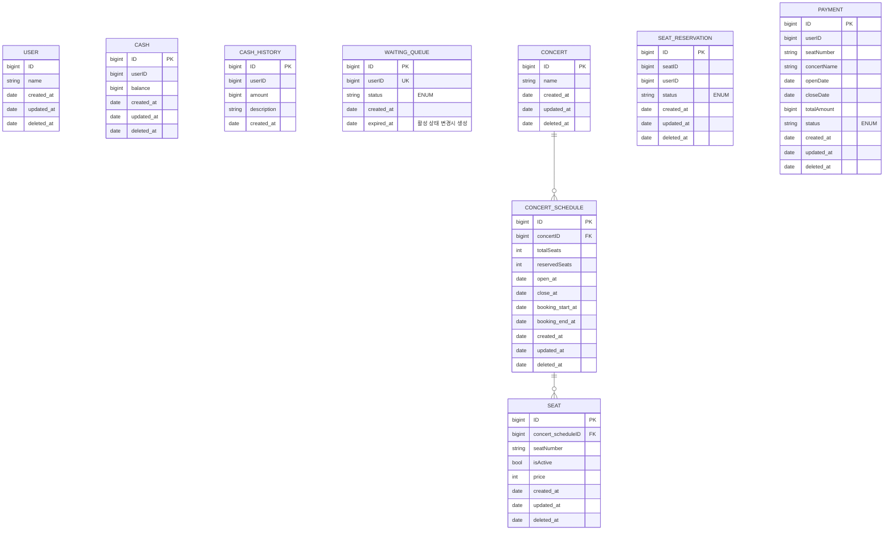

# 콘서트 예약 서비스

<aside>
💡 분산 환경에서도 대기열처리가 가능한 서버를 구현합니다.

## Description

- **`콘서트 예약 서비스`** 를 구현합니다.
- 대기열 시스템을 구축하여, 예약 서비스는 작업 가능한 유저만 수행할 수 있도록 합니다.
- 사용자는 좌석 예약 시에 미리 충전한 잔액을 이용합니다.
- 좌석 예약 요청 시 결제가 이루어지지 않더라도 일정 시간 동안 다른 유저가 해당 좌석에 접근할 수 없도록 합니다.

## Requirements

- 아래 5가지 API를 구현합니다.
    - 유저 토큰 발급 API
    - 예약 가능 날짜 / 좌석 API
    - 좌석 예약 요청 API
    - 잔액 충전 / 조회 API
    - 결제 API
- 각 기능 및 제약사항에 대해 단위 테스트를 반드시 하나 이상 작성합니다.
- 다수의 인스턴스로 애플리케이션이 동작하더라도 기능에 문제가 없도록 작성합니다.
- 동시성 이슈를 고려하여 구현합니다.
- 대기열 개념을 고려하여 구현합니다.

## API Specs

1️⃣ **`주요` 유저 대기열 토큰 기능**

- 서비스를 이용할 토큰을 발급받는 API를 작성합니다.
- 토큰은 유저의 UUID와 해당 유저의 대기열을 관리할 수 있는 정보(대기 순서 또는 잔여 시간 등)를 포함합니다.
- 이후 모든 API는 이 토큰을 이용해 대기열 검증을 통과해야 이용 가능합니다. 
- `먼저 DB로 토큰을 구현` 하고 점진적으로 다른 스택으로 리팩토링을 합니다.

> 기본적으로 폴링으로 본인의 대기열을 확인한다고 가정하며, 다른 방안 또한 고려해보고 구현할 수 있습니다.

2️⃣ **`기본` 예약 가능 날짜 / 좌석 API**

- 예약 가능한 날짜와 해당 날짜의 좌석을 조회하는 API를 각각 작성합니다.
- 예약 가능한 날짜 목록을 조회할 수 있습니다.
- 날짜 정보를 입력받아 예약 가능한 좌석 정보를 조회할 수 있습니다.

> 좌석 정보는 1~50까지의 좌석번호로 관리됩니다.

3️⃣ **`주요` 좌석 예약 요청 API**

- 날짜와 좌석 정보를 입력받아 좌석을 예약 처리하는 API를 작성합니다.
- 좌석 예약과 동시에 해당 좌석은 그 유저에게 약 (예: 5분)간 임시 배정됩니다. (시간은 정책에 따라 자율적으로 정의합니다.)
- 배정 시간 내에 결제가 완료되지 않으면 좌석에 대한 임시 배정이 해제되어야 하며, 임시 배정된 상태라면 다른 사용자는 예약할 수 없어야 합니다.

4️⃣ **`기본` 잔액 충전 / 조회 API**

- 결제에 사용될 금액을 API를 통해 충전하는 API를 작성합니다.
- 사용자 식별자 및 충전할 금액을 받아 잔액을 충전합니다.
- 사용자 식별자를 통해 해당 사용자의 잔액을 조회합니다.

5️⃣ **`주요` 결제 API**

- 결제 처리하고 결제 내역을 생성하는 API를 작성합니다.
- 결제가 완료되면 해당 좌석의 소유권을 유저에게 배정하고 대기열 토큰을 만료시킵니다.

6️⃣ **`대기열` 고도화**

- 다양한 전략을 통해 합리적으로 대기열을 제공할 방법을 고안합니다.
- e.g: 특정 시간 동안 N명에게만 권한을 부여한다.
- e.g: 한번에 활성화된 최대 유저를 N으로 유지한다.

</aside>

## 📅 Milstone

<details>
<summary> Milstone</summary>


</details>

## 💡Sequence
<details>
<summary> Sequence Diagrams</summary>

</Br>

<details>
<summary> 토큰 발급 API (POST)</summary>

### 토큰 발급 API (POST)
> 대기열 토큰 발급

</details>

<details>
<summary> 대기열 상태 확인 API (GET)</summary>

### 대기열 상태 확인 API (GET)
> 대기열 상태 확인

</details>

<details>
<summary> 예약 가능 날짜 조회 API (GET)</summary>

### 예약 가능 날짜 조회 API (GET)
> 예약 가능 좌석 조회

</details>

<details>
<summary> 예약 가능 좌석 조회 API (GET)</summary>

### 예약 가능 좌석 조회 API (GET)
> 예약 가능 좌석 조회

</details>

<details>
<summary> 잔액 충전 API (POST)</summary>

### 잔액 충전 API (POST)
> 예약 가능 좌석 조회 요청

</details>

<details>
<summary> 잔액 조회 API (GET)</summary>

### 잔액 조회 API (GET)
> 예약 가능 좌석 조회

</details>

<details>
<summary> 좌석 예약 API (POST)</summary>

### 좌석 예약 API (POST)
> 좌석 예약 요청

</details>

<details>
<summary> 결제 API (POST)</summary>

### 결제 API (POST)
> 결제

</details>

<details>
<summary> BACKGROUND-A</summary>

### BACKGROUND-A
> 대기열 만료 처리

</details>

<details>
<summary> BACKGROUND-B</summary>

### BACKGROUND-B
> 좌석 예약 만료 처리

</details>

</details>


## 🗂️ ERD

<details>
<summary> ERD</summary>



</details>


<!-- ## API

<details>
<summary>🔍 API Documentation</summary>

### API 명세서

#### 1. 유저 토큰 발급

- **경로**: `POST /queue/issue`
- **설명**: 대기열 토큰을 발급받습니다.
- **Request**:
    - **Body**
        - `userId`: `string` - 사용자 ID
- **Response**:
    - **200 OK**:
        ```json
        {
          "success": true,
          "data": {
            "token": "queue-uuid",
            "status": "pending"
          }
        }
        ```
    - **400 Bad Request**: `userId`가 유효하지 않을 때
        ```json
        {
          "success": false,
          "message": "Invalid userId"
        }
        ```

#### 2. 예약 가능 날짜 조회

- **경로**: `GET /concert/available-dates`
- **설명**: 예약 가능한 날짜 목록을 조회합니다.
- **Request**: 
    - **Headers**
        - `queue-token`: `string` - 대기열 토큰
- **Response**:
    - **200 OK**:
        ```json
        {
          "success": true,
          "data": [
            {
              "id": 1,
              "totalSeats": 50,
              "reservedSeats": 38,
              "open_at": "2024-01-01T00:00:00",
              "close_at": "2024-01-01T00:00:00"
            },
            {
              "id": 2,
              "totalSeats": 50,
              "reservedSeats": 48,
              "open_at": "2024-01-03T00:00:00",
              "close_at": "2024-01-03T00:00:00"
            }
          ]
        }
        ```
    - **401 Unauthorized**: 큐 토큰이 없거나 유효하지 않을 때
        ```json
        {
          "success": false,
          "message": "Unauthorized"
        }
        ```

#### 3. 예약 가능 좌석 조회

- **경로**: `GET /concert/available-seats`
- **설명**: 특정 콘서트 일정에 예약 가능한 좌석 목록을 조회합니다.
- **Request**:
    - **Headers**
        - `queue-token`: `string` - 대기열 토큰
    - **Query Parameters**
        - `concertScheduleId`: `number` - 콘서트 일정 ID
- **Response**:
    - **200 OK**:
        ```json
        {
          "success": true,
          "data": [
            {
              "id": 1,
              "seatNumber": "1",
              "price": 1000
            },
            {
              "id": 2,
              "seatNumber": "50",
              "price": 5000
            }
          ]
        }
        ```
    - **400 Bad Request**: `concertScheduleId`가 유효하지 않을 때
        ```json
        {
          "success": false,
          "message": "Invalid concertScheduleId"
        }
        ```
    - **401 Unauthorized**: 큐 토큰이 없거나 유효하지 않을 때
        ```json
        {
          "success": false,
          "message": "Unauthorized"
        }
        ```

#### 4. 좌석 예약 요청

- **경로**: `POST /reservation`
- **설명**: 좌석 예약을 요청합니다.
- **Request**:
    - **Headers**
        - `queue-token`: `string` - 대기열 토큰
    - **Body**
        - `seatId`: `number` - 좌석 ID
- **Response**:
    - **200 OK**:
        ```json
        {
          "success": true,
          "data": {
            "id": 1,
            "seat": {
              "id": 1,
              "isActive": false,
              "seatNumber": 1
            },
            "status": "PENDING",
            "created_at": "2024-01-01T00:00:00"
          }
        }
        ```
    - **400 Bad Request**: `seatId`가 유효하지 않을 때
        ```json
        {
          "success": false,
          "message": "Invalid seatId"
        }
        ```
    - **401 Unauthorized**: 큐 토큰이 없거나 유효하지 않을 때
        ```json
        {
          "success": false,
          "message": "Unauthorized"
        }
        ```

#### 5. 잔액 충전

- **경로**: `POST /user/charge`
- **설명**: 유저의 포인트를 충전합니다.
- **Request**:
    - **Body**
        - `amount`: `number` - 충전할 금액
        - `userId`: `string` - 사용자 ID
- **Response**:
    - **200 OK**:
        ```json
        {
          "success": true,
          "data": {
            "balance": 1000
          }
        }
        ```
    - **400 Bad Request**: `amount`나 `userId`가 유효하지 않을 때
        ```json
        {
          "success": false,
          "message": "Invalid amount or userId"
        }
        ```

#### 6. 잔액 조회

- **경로**: `GET /user/check`
- **설명**: 유저의 포인트 잔액을 조회합니다.
- **Request**:
    - **Query Parameters**
        - `userId`: `string` - 사용자 ID
- **Response**:
    - **200 OK**:
        ```json
        {
          "success": true,
          "data": {
            "balance": 1000
          }
        }
        ```
    - **400 Bad Request**: `userId`가 유효하지 않을 때
        ```json
        {
          "success": false,
          "message": "Invalid userId"
        }
        ```

#### 7. 결제 요청

- **경로**: `POST /payment`
- **설명**: 결제를 요청합니다.
- **Request**:
    - **Headers**
        - `queue-token`: `string` - 대기열 토큰
    - **Body**
        - `seatId`: `number` - 좌석 ID
- **Response**:
    - **200 OK**:
        ```json
        {
          "success": true,
          "data": {
            "seatNumber": 1,
            "concertName": 1,
            "openDate": "2024-01-01T00:00:00",
            "closeDate": "2024-01-01T00:00:00",
            "totalAmount": 1000,
            "status": "PENDING"
          }
        }
        ```
    - **400 Bad Request**: `seatId`가 유효하지 않을 때
        ```json
        {
          "success": false,
          "message": "Invalid seatId"
        }
        ```
    - **401 Unauthorized**: 큐 토큰이 없거나 유효하지 않을 때
        ```json
        {
          "success": false,
          "message": "Unauthorized"
        }
        ```
</details> -->

## 🔍 Swagger

<details>
<summary> Swagger </summary>
<br>


<br>


<br>


<br>


<br>


<br>


<br>


<br>


</details>

## 🔒 Concurrency Control

<details>
<summary> Concurrency Control </summary>
<br>

# 동시성 제어 방식 비교 및 구현

## 동시성 문제 발생 지점 및 해결

- 콘서트 좌석 점유 & 예약 인원 변경
```
시나리오: 동일한 좌석에 대해 다수의 예약 요청이 동시에 발생한다.

문제: 실제 좌석 점유 가능 인원은 1명임에도 예약 인원 필드의 값이 1명 이상 증가될 위험이 있다.

발생 가능성: 높음

재시도 필요 유무: 무

해결: 좌석점유에서 낙관락을 이용해 최초 좌석 점유 요청 이후 모두 throw 한다.

이유: 현재 로직은 좌석 점유 후 예약 인원 변경이 되고 있습니다. 
좌석 점유에 낙관락을 적용하여 유효한 첫 번째 요청 이외에는 전부 throw 시키게 되면
자연스럽게 후속작업인 예약 인원 변경도 동시성 제어가 된다고 판단했습니다.
부하 측면에서는 재시도가 없다는점 , 그리고 최초 좌석 점유 경쟁 이후에 모든 요청은 
예약가능 좌석 조회 READ에서 예약 불가 좌석으로 노출될 것이기 떄문에
좌석별 최초 점유 경쟁 이후엔 부하가 크지 않을 것이라 생각 했습니다.

** 근데 만약 대용량 트래픽 환경이라고 한다면 분산락으로 전환이 필요할 것 같습니다.
```
- 결제
```
시나리오: 같은 결제 요청 건에 대하여 동시에 중복 요청이 발생한다.

문제: 하나의 예약에 대한 결제임에도 캐시가 중복 차감될 위험이 있다.

발생 가능성: 낮음

재시도 필요 유무: 무

해결: 낙관락을 이용해 중복 요청을 방지한다.

이유: 발생 가능성이 많지 않다고 판단했고 중복 요청 발생시 의도하지않은 금액 차감이 이루지면 안된다고 생각했습니다.
```
```
시나리오: 동일한 유저의 잔액 충전 요청이 동시에 다수 발생한다.

문제: 동시성 문제로 일부 요청의 반영이 누락되어 기대 금액만큼 충전이 되지 않을 수 있다.

발생 가능성: 낮음

재시도 필요 유무: 무

해결: 비관락을 이용해 충전 요청은 누락없이 반영한다.

이유: 발생 가능성은 낮지만 ( 동시성 이슈가 생길정도로 단시간에 다수의 충전요청 ) 만약 상황이 발생한다면
고객은 돈을 결제하고 포인트를 충전할 것이기 때문에 모든 요청은 빠짐없이 반영되어야 한다고 생각했습니다. 
```
- 의사결정 이유
```
구현 복잡도가 낮고 기본적인 기술부터 차례로 검토하며 의사 결정을 위한 당위성을 찾았습니다.
좋아 보이고 남들이 많이 쓴다는 것부터 도입해 보고 싶은 충동도 있었지만 (??? : 아~ 카프카 쓰라고~)
기초적인 것들에서부터 이 이상의 것이 필요한지를 고민하며 넘어오다 보니 
현 시점에서는 이 이상의 것이 필요하지 않다고 생각하여 낙관락과 배타락으로 구현하였습니다.

만.. 아직 기초가 많이 부족해서 올바른 결정을 내린건지 스스로 판단하기가 어려운 상태라 노력이 더 필요합니다. ㅠㅠ
삐뚤어진 선택들이 보인다면 폭풍 지적 부탁드리겠습니다!
```


## 환경
- OS: macOS
- CPU: Apple M3 Pro, 11-core , 14-core GPU
- Memory: 18GB LPDDR5
- Storage: 512GB SSD
- Docker
- ELK
- Grafana
- Prometheus


## 테스트 신뢰성
- 로컬에서 진행되어 테스트 케이스 이외의 요인에 의한 자원 소모가 있습니다.
- 각 테스트 케이스 실행 시 테스트에 필요한 데이터 시딩으로 인해 자원 소모가 있습니다.
- 종합: 모니터링 데이터는 실제 테스트 케이스에 의한 변동값 이외의 요인에 의한 값도 반영되어 있기 때문에 참고용으로만 봐주시기 바랍니다.


## 참고자료 링크
- https://dev.mysql.com/doc/refman/8.4/en/innodb-locking.html
- https://dev.mysql.com/doc/refman/8.4/en/innodb-transaction-model.html
- https://redis.io/topics/internals
- https://redis.io/commands/publish
- https://redis.io/docs/latest/develop/interact/pubsub/
- https://redis.io/topics/distlock
- https://www.rabbitmq.com/documentation.html
- https://kafka.apache.org/documentation/
- https://www.rabbitmq.com/getstarted.html

## 동시성 제어 방식

### 1. Simple Lock
- **설명**: 간단하게 락을 획득하고 릴리즈하는 방식
- **장점**: 구현이 간단하다.
- **단점**: 분산 환경에서 사용이 불가능하고 대용량 트래픽 시 부하가 크다.
<details>
  <summary><h3> 📈 테스트 자료 << 💡Click💡 </h3></summary>
 
  ### 캐시 사용 , 충전. { 각 실행 수 : 3000 }

  
  

  
  - **테스트 소요 시간**


   

</details>

### **정리**

```
가장 간단한 Lock 전략이다.

구현 가능하지만 분산환경에서는 사용할 수 없다.

사용 환경이 모놀리틱하다고 하더라도 만약 단순히 락 획득에 실패하면 '나가' 할 거면 모를까

획득 재시도를 일정 주기마다 한다면 대용량 트래픽이 쏟아질 때 nodejs 같은 싱글 스레드는 더욱 더 성능 이슈가 생길 수밖에 없다.

```


### 2. Spin Lock
- **설명**: 락이 있는지 없는지 계속 확인하며 기다리는 방식
- **장점**: 구현이 간단하다.
- **단점**: 싱글 스레드 환경에서는 성능에 큰 영향을 미치고 이벤트 루프가 블로킹될 수 있다.
```
심플락은 일정 주기마다 재실행했다면 이 스핀락은 스레드를 쉬지 않고 굴리는 락이다. (스레드가 빙빙 돈다고 스핀락이라고 한다더라)

자바 같은 멀티스레드는 어떨지 모르겠지만 nodejs 같은 싱글 스레드는 while로 스레드를 계속 굴리면 이벤트 루프가 블로킹 된다.

실제로 테스트를 해보니 요청이 2개만 동시에 들어가도 서버 전체가 굳어버린다.

첫 번째 요청이 작업을 처리하는 동안 두 번째 요청이 스핀을 돌며 

스레드를 점유해버려서 진행 중이던 요청, 들어오는 요청 모두 블로킹 된다.

이건 테스트 자료가 무의미하다.
```

### 3. Pessimistic Lock (비관적 락)
- **설명**: 트랜잭션이 특정 데이터 항목에 접근할 때 다른 트랜잭션이 접근하지 못하도록 잠그는 방식
- **장점**: 더티 리드 문제가 없다.
- **단점**: 대용량 트래픽 발생시 디비에 부하를 전가시킨다. 시스템 전반에 장애를 야기할 수 있다.

<details>
  <summary><h3> 📈 테스트 자료 << 💡Click💡 </h3></summary>

  ### 캐시 사용 , 충전. { 각 실행 수 : 3000 }


  
  
  - ** 테스트 소요 시간  **


  
  </details>

  ### **정리**
  
```
위 테스트 자료 중 Lock Waits와 Lock Time 차트를 보면 알겠지만 락 경합이 발생한 것을 알 수 있다.

즉 DB락을 직접 이용하는 락이다.

비관적 락이라는 건 구체적인 기능이 아니라 트랜잭션의 접근 방지를 위한 데이터 선점 전략을 표현한 개념이다.

이 개념에 속하는 구체적인 구현 기능들이 배타락, 공유락이라고 보면 될 것 같다.

공유락은 트랜잭션들이 읽기는 가능하지만 쓰기는 불가능하게 한다. (SELECT * FROM sexy WHERE 태환 = 1 FOR SHARE)

보통 데이터 분석이나 보고서 작성 혹은 금융 데이터 등에 사용이 많이 된다.

예를 들어 a와 b의 계좌에서 돈이 오고 가야 하는 경우라면 이 계좌는 트랜잭션이 진행되는 동안 변경되어서는 안 된다.

이때 공유락을 걸어 모두 읽을 수는 있지만 변경되지는 않게 한다.

배타락은 엄격하게 동시성 제어를 해야 할 경우에 사용된다.

동시에 접근하는 트랜잭션들 중 하나의 트랜잭션에게만 접근 권한을 부여한다. (SELECT * FROM sexy WHERE 태환 = 1 FOR UPDATE)

이렇게 하면 트랜잭션은 한 번에 하나씩만 해당 데이터에 접근할 수 있다.

조금 더 이해하기 쉽게 innoDB 엔진이 내부적으로 어떻게 트랜잭션 Lock을 처리하는지를 다음과 같이 풀어보았다.

1. a-tx, b-tx, c-tx, d-tx => 동시에 동일한 좌석 레코드를 점유하기 위해 접근.
2. innoDB 엔진은 먼저 도착한 c-tx(가정)의 요청 lock 정보를 읽고 lock list를 생성한다.
3. lock list에는 요청받은 락 종류와 요청한 c-tx 정보를 담고 c-tx의 상태를 기록한다. => RUNNING
4. 나머지 tx는 lock queue를 생성하여 저장한다.
5. c-tx의 작업이 커밋 또는 롤백되면 innoDB는 lock list에서 c-tx의 상태를 변경하고 큐에서 다음 tx를 꺼내 lock list에 적재시킨다.

innoDB 엔진은 위와 같은 플로우로 배타락을 처리하여 한 번에 하나의 트랜잭션에게만 접근 권한을 부여함으로써 트랜잭션의 일관성과 격리성을 보장한다.

위와 같이 Lock 처리를 우리가 체감하지 못하는 사이에 (물론 대용량 I/O에서는 많이 체감되겠지만) 내부적으로 많은 일이 일어나고 있는데, 그만큼 요청이 많아지면

DB 부하가 많이 생길 수밖에 없다.

운영 서비스의 트래픽이 전체적으로 널널하고 어쩌다 한 번 약간의 스파이크가 생기는, 낙관락으로 처리하기는 조금 버거운 정도라면 충분히 효율적이라고 생각한다.

그러나 대규모 트래픽을 모두 배타락으로 받아버리면 DB에 부하가 몰려 전반적인 서비스 품질이 낮아지고 광범위한 시스템 장애를 초래할 수 있다.
```


### 4. Optimistic Lock (낙관적 락)
- **설명**: 읽기와 쓰기를 자유롭게 허용하지만, 쓰기 시점에 버전 컬럼을 확인해 변경을 감지하는 방식
- **장점**: 디비 락 이라기 보다는 전략으로써 직접적으로 디비에 락을 걸지않아 부하가 적다.
- **단점**: 동시성 문제가 빈번하고 대규모 트래픽일 경우 성능 이슈가 생긴다.

<details>
  <summary><h3> 📈 테스트 자료 << 💡Click💡 </h3></summary>

  ### 캐시 사용 , 충전. { 각 실행 수 : 3000 }


  
  - **테스트 소요 시간**


</details>

### **정리**

```
위 테스트 자료를 보면 한 가지 의문이 생긴다.

'분명 낙관락은 디비 락이 아니라 그냥 전략이라면서 왜 락 경합이 감지된 거지?'

위 의문을 설명하기 전에 간단하게 낙관락의 작동 방식을 알아보자.

낙관락은 기본적으로 버전 컬럼을 이용해 조회 시점의 version과 update 시점의 version을 비교하여 버전이 그대로라면 최종 수정을 한다.

즉 DB 락을 이용하는 게 아니라 전략적으로 lock을 구현하는 것이다.

그럼 이때 DB락을 쓰지 않는데 왜 트랜잭션 경합이 감지된 걸까?

그 이유는 innoDB의 update 처리 방식에 있다.

innoDB는 특정 레코드를 update하기 위해 조건에 맞는 인덱스를 찾아 레코드 락을 걸게 된다.

해당 레코드를 읽은 시점과 update 사이에 값이 변경되면 안 되기 때문인데, 이 때문에 낙관락을 사용할 때 트랜잭션 경합이 감지되는 것이다.

조금 더 풀어서 이야기하면 동시에 여러 트랜잭션이 인덱스를 찾아 접근할 때 먼저 도착한 트랜잭션이 이전 비관락에서 설명했던 것처럼 해당 레코드를 선점하게 되고

나머지 트랜잭션은 앞서 선점한 트랜잭션이 커밋 혹은 롤백하기를 기다리게 되는데 이 때문에 트랜잭션 경합이 그라파나 차트에 감지된 것이다.

이렇게 보면 앞서 설명했던 배타락보다는 잠금 범위가 굉장히 좁기 때문에 상대적으로 리소스가 덜 든다고 느껴진다.

' 어 그럼 비관락 왜씀? 그냥 다 낙관락으로 처리하는 게 짱 아님? '

만약 동시성 이슈가 발생할 가능성이 낮고 있더라도 어쩌다 높지 않은 트래픽이라면 retry 전략과 함께 충분히 효율적으로 처리가 가능할 것이다.

그러나 대용량 트래픽과 동시성 이슈 발생 가능성이 높은 곳에 이렇게 사용하게 되면 결국 CPU 바운드가 발생할 가능성이 높아진다. (트랜잭션 경합까지 겹쳐 지연 시간은 계속 늘어난다.) 

nodejs를 사용하는 입장에서는 위 심플락과 스핀락에서 언급했던 nodejs의 특성으로 인해 더욱 치명적일 수 있으니 충분히 innoDB의 CRUD 메커니즘을 이해하고 상황에 맞게 사용해야 한다.
```
  
### 5. Pub/Sub Lock (Redis)
- **설명**: Redis의 Pub/Sub 기능을 이용해 락을 획득하고 해제하는 방식
- **장점**: 메시지 기반으로 비동기 처리가 가능하다.
- **단점**: Redis Pub/Sub은 전달 성공을 보장하지 않으므로 메시지 손실 가능성이 있다.

<details>
  <summary><h3> 📈 테스트 자료 << 💡Click💡 </h3></summary>

  ### 캐시 사용 , 충전. { 각 실행 수 : 3000 }


  
  - **테스트 소요 시간**


</details>

### **정리**

```
Pub/Sub Lock은 레디스의 메시지 발행 기능을 이용해 구현한 락이다.

Redis의 pub/sub 작동 방식을 대략적으로 이해한다면 이를 이용한 lock을 어떻게 구현하는 것인지 조금 더 이해하기 쉬울 것이다.

Redis의 pub/sub은 대략적으로 다음의 프로세스로 처리된다.

1. 사용자가 publish를 이용해서 'taehwan'이라는 메시지를 발행한다.
2. Redis 서버는 발행을 감지하면 해시테이블에서 전달받은 'taehwan'이라는 채널을 구독하는 구독자 목록을 조회한다.
3. 조회된 구독자들은 Redis 서버와 TCP 소켓으로 연결되어 있는데, Redis는 각 구독자의 소켓 버퍼에 쓰여진다.
4. 구독자는 쓰여진 메시지를 소켓에서 읽어낸다.

TCP를 쓰다 보니 기본적으로 순서가 보장된다는 점과 Redis의 단일 스레드로 인한 순차 처리 특징이 결합되어 메시지 순차 전달을 보장할 수 있다.

이제 대략적으로 Redis의 pub/sub이 어떻게 동작하는지 알게 되었으니 이걸로 lock을 어떻게 쓰겠다는 건지 이해가 될 것이다.

대략적으로 다음과 같은 형태를 취할 것이다.

1. 최초에 락을 획득한다.
2. 이후 요청은 락 획득에 실패하고 lock:xx 채널을 구독하고 대기한다.
3. 최초에 락을 획득한 스레드가 작업을 마치고 락을 해제하며 락 해제 메시지를 발행한다.
4. 구독하고 대기하던 다음 요청이 메시지를 받고 락을 획득한다.

이제 직접 주기적으로 락 상태를 확인하고 획득하는 로직을 구현할 필요가 없어졌다.

DB에 부하를 주지 않으며 Redis의 빠른 처리 속도로 빠르게 동시성 제어를 할 수 있게 되었다.

그러나 이 방식에도 문제점이 존재한다.

위에서 이야기했듯이 이 방식은 소켓을 이용한다.

대용량 트래픽일 경우에는 많은 리스너가 계속해서 소켓을 연결하고 대기해야 하고 락 획득을 위한 재시도 로직으로 인한 부하도 발생할 수 있으니 부하가 상당해질 수밖에 없다.

이렇게 소켓 의존도가 높다 보니 잠깐이라도 네트워크 유실 혹은 장애가 발생할 경우 모든 메시지가 소실될 수 있다.

그리고 무엇보다 Redis의 pub/sub 기능은 메시지 전달과 내구성을 보장하지 않는다.

그렇기 때문에 메시지 소실이 상당한 장애를 초래하거나 손실을 야기할 수 있는 로직에는 충분히 고민하고 적용시켜야 한다.

```


### 6. Redis 분산 락
- **설명**: RedLock 알고리즘을 이용해 락 획득 및 해제 방식
- **장점**: 빠른 속도 , 간단한 구현
- **단점**: Redis 서버 장애 시 문제가 발생할 수 있다.

<details>
  <summary><h3> 📈 테스트 자료 << 💡Click💡 </h3></summary>

  ### 캐시 사용 , 충전. { 각 실행 수 : 3000 }


  
  - **테스트 소요 시간**


</details>

### **정리**

```
레디스를 이용해 분산 락을 구현하는 방식은 여러 가지가 있지만 나는 Redis가 공식적으로 분산 환경에서 사용하기를 권장하는 Redlock을 사용해 보았다.

레디스에서 Redlock을 공식적으로 권장하는 이유는 다음과 같다.

1. Redlock 알고리즘은 여러 노드를 이용해 락을 분산시켜 단일 노드보다 안전하고 네트워크 파티션이나 노드 장애가 발생해도 락의 일관성을 유지한다.
2. 1번의 이유로 고가용성을 보장한다.
3. 분산 환경에서도 노드 분산으로 데이터 일관성을 보장한다.

Redlock 알고리즘의 작동 방식은 다음과 같다.

1. 다수의 Redis 노드 설정
2. 클라이언트는 모든 Redis 노드에 동일한 키를 설정하고, 일정 시간(TTL) 동안 락 획득 시도
3. 과반수 성공 확인: 일정 수(N/2 + 1) 이상의 노드에서 락을 성공적으로 획득했는지 확인
4. 락의 TTL이 만료되기 전에 갱신하거나, 작업이 완료되면 락을 해제

추가적으로 다수의 요청으로 인한 충돌을 완화하기 위해 지수적 백오프를 적용시키면 효율이 더욱 향상된다.

노드를 확장하거나 클러스터링함으로써 트래픽에 효과적으로 대응할 수 있다는 장점도 존재한다.

그러나 순간 대용량 트래픽 스파이크가 발생할 경우 대기가 많아지면 재시도 처리로 인한 부하가 발생할 수 있으니 이 부분을 잘 고려해야 한다.

락 획득, 검증 등과 같은 간단한 데이터 처리에는 굉장히 효율적이고 강력하다고 생각한다.

```

### 7. Kafka를 이용한 동시성 제어
- **설명**: 카프카의 단일파티션 특성을 이용한 동시성 제어
- **장점**: 고가용성, 확장성, 높은 성능
- **단점**: 구현 복잡도가 높고 러닝커브가 있다.

<details>
  <summary><h3> 📈 테스트 자료 << 💡Click💡 </h3></summary>

  ### 캐시 사용 , 충전. { 각 실행 수 : 3000 }


  
  - **테스트 소요 시간**


</details>

### **정리**

```
카프카는 대용량 데이터 스트리밍에 특화되어 있어 정말 많은 곳에서 사용되고 있다.

로그 처리, 분석, 데이터 파이프라인, 이벤트 처리 등 다양한 용도로 활용된다.

그러나 지금은 동시성 제어에 대한 이야기를 하고 있으니 다른 기능들에 대한 설명은 나중으로 미루어두고 어떻게 동시성 제어가 되는지 알아보자.

카프카는 크게 프로듀서(Producer), 브로커(Broker), 컨슈머(Consumer)로 나누어져 있다.

브로커는 카프카 클러스터를 구성하는 서버 인스턴스이다.

토픽이라는 데이터 카테고리를 기준으로 파티션이 생성되며, 각 토픽은 하나 이상의 파티션으로 나뉘어진다.

이 파티션들은 브로커에 분산 저장되어 병렬 처리가 가능하게 한다.

카프카를 이용해 동시성 제어가 가능한 이유는 파티션 내에 데이터를 보관할 때 오프셋을 포함시킨다는 것과 단일 파티션일 때는 하나의 컨슈머에게 순서대로 메시지를 제공하기 때문이다.

이를 기반으로 메시지를 순차적으로 소비할 수 있고, 장애 발생 혹은 컨슈머가 일정 기간 메시지를 소비하지 않다가 다시 메시지를 가져갈 때도 마지막 메시지 이후 데이터를 반환함으로써 순서를 보장할 수 있다.

그러나 토픽을 여러 파티션으로 나누게 되면 데이터가 병렬로 처리되기 때문에 동시성 제어에는 적합하지 않다.

테스트 자료를 보면 알 수 있듯 성능은 지금까지 테스트한 다른 무엇보다도 강력하다.

궁금해서 요청 수를 3만 개로 늘려봤는데 0.3초 걸리던 게 0.6초로 늘어난 게 끝이다.

구현 복잡도가 높고 동시성 제어만으로 사용하기에는 오버엔지니어링이라고 생각한다.


```


### 8. RabbitMQ를 이용한 동시성 제어
- **설명**: 메시징 큐의 특성을 이용해 순차적으로 메시지를 소비하며 동시성 제어
- **장점**: 메시지의 신뢰성이 높다.
- **단점**: 대용량 데이터 스트림에는 부족하다.


<details>
  <summary><h3> 📈 테스트 자료 << 💡Click💡 </h3></summary>

  ### 캐시 사용 , 충전. { 각 실행 수 : 3000 }


  
  - **테스트 소요 시간**


</details>

### **정리**

```
RabbitMQ는 AMQP(Advanced Message Queuing Protocol)를 기반으로 설계되었으며, 메시지 큐잉과 다양한 메시징 패턴(라우팅, 주제 기반 메시징, 작업 큐 등)을 지원한다.

RabbitMQ도 카프카처럼 정말 많은 기능과 활용 범위가 있지만, 지금은 동시성 제어에 대해서만 이야기를 할 것이기 때문에 나머지는 나중에 또 알아보자.

RabbitMQ는 기본적으로 메시지를 받아 큐에 저장하고 컨슈머가 이를 가져가 처리하는 방식을 취하는데, 이러한 특성 때문에 동시성 제어 또한 쉽게 구현해낼 수 있다.

그리고 RabbitMQ는 메시지 전달을 보장하고 메시지 내구성을 제공하는데 (카프카만큼은 아니지만) 이를 통해 장애 복구 등 메시지 전달 신뢰성을 가지고 있다.

또한 확장도 쉽게 할 수 있고 구현 복잡도도 그다지 높지 않기 때문에 정말 좋은 선택이라고 생각한다.

대용량 데이터를 처리할 때 처리 용량을 넘어서게 되면 메시지를 플러시하면서 성능이 급격히 떨어질 수 있다는 점은 주의해야 한다.

테스트 결과를 보면 알겠지만 정말 강력하다.

동시성 제어만으로는 RabbitMQ도 오버엔지니어링이라고 생각한다.

```


## 동시성 제어 방식의 비교

| 방식         | 구현 복잡도 | 성능          | 효율성    | 장점                                                    | 단점                                                      |
|--------------|-------------|---------------|-----------|---------------------------------------------------------|-----------------------------------------------------------|
| Simple Lock  | 낮음        | 중            | 중        | 구현이 간단                                              | 분산 환경에서 사용 불가, 대용량 트래픽 시 부하 큼           |
| Spin Lock    | 낮음        | 낮음          | 낮음      | 구현이 간단                                              | 성능에 큰 영향, 이벤트 루프 블로킹 가능                    |
| Pub/Sub Lock | 중간        | 중            | 중        | 메시지 기반 비동기 처리 가능                              | 메시지 손실 가능성                                        |
| Pessimistic Lock | 중간    | 낮음          | 낮음      | 더티 리드 문제 없음                                      | 많은 트랜잭션 시 성능 저하                                 |
| Optimistic Lock  | 중간    | 중            | 중        | 경합이 적은 환경에서 유효                                | 동시성 제어가 빈번한 환경에서는 성능 저하                         |
| Redis 분산 락     | 중간    | 높음          | 높음      | 빠른 속도                                                | 단일스레드. 확장을 깊게 고려해야함                          |
| Kafka를 이용한 동시성 제어     | 높음    | 높음          | 높음      | 고가용성, 확장성                                          | 설정이 복잡, 러닝커브 있음                                               |
| RabbitMQ를 이용한 동시성 제어  | 높음    | 높음          | 높음      | 메시지 신뢰성 높음 , 비교적 간단한 설정                     | 대용량 데이터 처리 한계                                               |


</details>


## 🔨 Optimizing Performance with Caching

<details>
<summary> Optimizing Performance with Caching </summary>
<br>

# 캐싱 및 Redis 로직 이관을 통한 성능 개선 분석

## 환경
- OS: macOS
- CPU: Apple M3 Pro, 11-core , 14-core GPU
- Memory: 18GB LPDDR5
- Storage: 512GB SSD
- Docker
- ELK
- Grafana
- Prometheus


# 조회 속도 개선 가능 항목 검토
| 항목       | 사용자 1명당 콘서트 예약까지 다수의 조회가 예상되는 항목 | 예상 사유                                                                                 |
|------------|------------------------------------------|-------------------------------------------------------------------------------------|
| 포인트 조회 | X                                        | 포인트 조회는 결제할 때나 궁금해서 한 번 확인할 가능성이 크다.                                           |
| 대기열 조회 | O                                        | 대기열 조회는 등록 후 지속적으로 자신의 상태를 폴링으로 확인한다.                                        |
| 콘서트 조회 | O                                        | 사용자는 콘서트 목록을 무조건 조회할 것이다. 또한 콘서트는 애그리거트 루트이므로 하위 모델을 제어하기 위해 빈번한 조회가 발생한다.                                        |
| 스케쥴 조회 | O                                        | 스케쥴 조회는 사용자가 다양한 공연 일정을 확인하기 위해 여러 번 조회할 가능성이 높다.                               |
| 좌석 조회   | O                                        | 좌석 조회는 원하는 좌석을 확보하기 위해 여러 번 재조회가 발생할 수 있다.                                          |
| 예약 조회   | X                                        | 예약 조회는 주로 결제 시점에 내부적으로 조회되는 경우가 많아 횟수가 적다.                                         |
| 결제 조회   | X                                        | 결제 조회는 결제 완료 직후 한 번 확인하고 이후에 시간이 지나 한두 번 더 보는 경우가 많을 것이다.                              |

# 의사결정
- 대기열
```
가장 많은 조회가 일어나고 데이터를 영속시킬 필요는 없는 도메인이기 때문에,
성능 향상을 위해 RDBMS에서 인메모리 데이터 저장소로 이관을 선택했습니다.
```

- 콘서트 ( 스케쥴 , 좌석 포함 )
```
스케쥴과 좌석에는 각각 실시간성을 요하는 컬럼이 포함되어 있습니다.

• 스케쥴: 현재 예약 인원
• 좌석: 좌석 활성 상태

조회 성능 향상 방법 두 가지를 기준으로 고민했습니다.

1. 캐싱

스케쥴과 좌석은 각각 실시간성을 요구하는 컬럼이 존재합니다.

캐싱을 위해 각각의 상태를 별도로 관리하는 테이블로 실시간성을 요하는 컬럼을 분리한다고 하여도 결국 실시간 정보가 포함된 테이블을 조회해야 하기 때문에 (실시간 잔여 좌석 및 좌석 활성 상태 확인) 캐싱을 위한 테이블 분리는 불필요하다고 생각했습니다.

실시간 좌석 정보를 예약 데이터로 처리할 수 있지만, 이는 좌석 수가 늘어날수록 불필요한 오버헤드가 선형적으로 늘어날 것이라고 생각했기 때문에
좌석 테이블에서 활성 상태를 직접 관리하는 방식을 선택했습니다.

2. 쿼리 튜닝

현재 상황에서 콘서트 도메인은 캐싱 처리가 비효율적이기 때문에 그 다음 대책으로 쿼리 튜닝을 떠올렸습니다.

이 부분은 다음 주 과정에 있다고 하여 이번에 시도하지는 않았습니다.
```


# 대기열 개선 전/후 성능 비교 부하 테스트
### 테스트 플로우
- 대기열 등록 후 자신의 대기열 상태 조회

### 테스트 지속 시간
- 1분

**<h2> Mysql TPS 100 </h2>**

<details>
  <summary><h2> 📈 테스트 자료 << 💡Click💡 </h2></summary>
      


</details>


### 시스템 성능 지표, 쿼리 성능 지표, 리소스 사용 지표

| 항목 | 시스템 성능 지표 | 쿼리 성능 지표 | 리소스 사용 지표 |
|--------------------------|--------------------------------------|--------------------------|-------------------------------|
| CPU 사용률 | 5%에서 15% 사이의 변동, 부하가 높은 시점에서 15%까지 상승 | | |
| 시스템 로드 | 4.05 | | |
| MySQL Queries Per Second | 13.9 | | |
| MySQL Connections | 14 | | |
| MySQL Table Locks | 0 | | |
| P50 응답 시간 | | 약 0.6s | |
| P90 응답 시간 | | 약 1.25s | |
| P95 응답 시간 | | 약 1.4s | |
| P99 응답 시간 | | 약 1.5s | |
| MySQL InnoDB Row Lock Waits | | 0 | |
| MySQL InnoDB Row Lock Time | | 0 | |
| MySQL Slow Queries | | 0 | |
| 디스크 읽기 완료 | | | 최대 약 30,000 |
| 디스크 쓰기 | | | 최대 약 4,000,000 |
| 메모리 사용 | | | 평균 85.6% ~ 86.1% |


### HTTP 요청 성능 지표 및 기타 지표


| 항목 | HTTP 요청 성능 지표 (TokenIssuance API) | HTTP 요청 성능 지표 (TokenStatus API) | 종합 HTTP 요청 성능 지표 |
|-----------------------------------------|-----------------------------------------|------------------------------------------|------------------------------------------|
| 평균 응답 시간 (avg) | 111.19ms | 110.47ms | |
| 최소 응답 시간 (min) | 1.12ms | 1.07ms | |
| 중앙값 응답 시간 (med) | 7.84ms | 7.72ms | |
| 최대 응답 시간 (max) | 993ms | 993ms | |
| P90 응답 시간 | 426.75ms | 428.61ms | |
| P95 응답 시간 | 665.72ms | 687.45ms | |
| HTTP 요청 수 (http_reqs) | | | 11,558회 |
| HTTP 요청 성공률 (http_req_success) | | | 100% |
| • 평균 | | | 111.16ms |
| • 최소 | | | 1ms |
| • 중앙값 | | | 7.8ms |
| • 최대 | | | 1.22s |
| • P90 | | | 426.7ms |
| • P95 | | | 665.72ms |


## Mysql TPS 500

<details>
  <summary><h2> 📈 테스트 자료 << 💡Click💡 </h2></summary>
      


</details>


### 시스템 성능 지표, 쿼리 성능 지표, 리소스 사용 지표

| 항목 | 시스템 성능 지표 | 쿼리 성능 지표 | 리소스 사용 지표 |
|--------------------------|--------------------------------------|--------------------------|-------------------------------|
| CPU 사용률 | 5%에서 25% 사이의 변동, 부하가 높은 시점에서 25%까지 상승 | | |
| 시스템 로드 | 5.60 | | |
| MySQL Queries Per Second | 499 | | |
| MySQL Connections | 14 | | |
| MySQL Table Locks | 0 | | |
| P50 응답 시간 | | 약 30s | |
| P90 응답 시간 | | 약 45s | |
| P95 응답 시간 | | 약 50s | |
| P99 응답 시간 | | 약 60s | |
| MySQL InnoDB Row Lock Waits | | 0 | |
| MySQL InnoDB Row Lock Time | | 0 | |
| MySQL Slow Queries | | 0 | |
| 디스크 읽기 완료 | | | 최대 약 200,000 |
| 디스크 쓰기 | | | 최대 약 8,000,000 |
| 메모리 사용 | | | 평균 81.0% ~ 82.5% |

### HTTP 요청 성능 지표 및 기타 지표

| 항목 | HTTP 요청 성능 지표 (TokenIssuance API) | HTTP 요청 성능 지표 (TokenStatus API) | 종합 HTTP 요청 성능 지표 |
|--------------------------|-----------------------------------------|-----------------------------------------|------------------------------------------|
| 평균 응답 시간 (avg) | 12.2s | 13.37s | |
| 최소 응답 시간 (min) | 0s | 831μs | |
| 중앙값 응답 시간 (med) | 6.53s | 6.74s | |
| 최대 응답 시간 (max) | 52.89s | 52.8s | |
| P90 응답 시간 | 39.03s | 39.66s | |
| P95 응답 시간 | 45.76s | 44.85s | |
| HTTP 요청 수 (http_reqs) | | | 18,135회 |
| HTTP 요청 성공률 (http_req_success) | | | 97.14% |
| • 평균 | | | 12.695s |
| • 최소 | | | 0s |
| • 중앙값 | | | 6.63s |
| • 최대 | | | 52.89s |
| • P90 | | | 39.31s |
| • P95 | | | 45.76s |


## REDIS TPS 1000

<details>
  <summary><h2> 📈 테스트 자료 << 💡Click💡 </h2></summary>


</details>

### 시스템 성능 지표, 쿼리 성능 지표, 리소스 사용 지표

| 항목 | 시스템 성능 지표 | 쿼리 성능 지표 | 리소스 사용 지표 |
|--------------------------|--------------------------------------|--------------------------|-------------------------------|
| CPU 사용률 | 20%에서 65% 사이의 변동, 부하가 높은 시점에서 65%까지 상승 | | |
| 시스템 로드 | 3.70 | | |
| MySQL Queries Per Second | 14.0 | | |
| MySQL Connections | 6 | | |
| MySQL Table Locks | 0 | | |
| P50 응답 시간 | | 약 0.05초 | |
| P90 응답 시간 | | 약 0.09초 | |
| P95 응답 시간 | | 약 0.095초 | |
| P99 응답 시간 | | 약 0.099초 | |
| MySQL InnoDB Row Lock Waits | | 0 | |
| MySQL InnoDB Row Lock Time | | 0 | |
| MySQL Slow Queries | | 0 | |
| 디스크 읽기 완료 | | | 최대 약 80 |
| 디스크 쓰기 | | | 최대 약 200,000 |
| 메모리 사용 | | | 평균 79.65% ~ 80% |

### HTTP 요청 성능 지표 및 기타 지표

| 항목 | HTTP 요청 성능 지표 (TokenIssuance API) | HTTP 요청 성능 지표 (TokenStatus API) | 종합 HTTP 요청 성능 지표 |
|-----------------------------------------|-----------------------------------------|------------------------------------------|------------------------------------------|
| 평균 응답 시간 (avg) | 630.15µs | 403.69µs | |
| 최소 응답 시간 (min) | 170µs | 128µs | |
| 중앙값 응답 시간 (med) | 345µs | 250µs | |
| 최대 응답 시간 (max) | 64.11ms | 59.85ms | |
| P90 응답 시간 | 458µs | 314µs | |
| P95 응답 시간 | 756µs | 417µs | |
| HTTP 요청 수 (http_reqs) | 117,766회 | 117,766회 | 235,532회 |
| HTTP 요청 성공률 (http_req_success) | 100% | 100% | 100% |
| • 평균 | | | 516.92µs |
| • 최소 | | | 128µs |
| • 중앙값 | | | 281µs |
| • 최대 | | | 64.11ms |
| • P90 | | | 416µs |
| • P95 | | | 611µs |


## REDIS TPS 3000

<details>
  <summary><h2> 📈 테스트 자료 << 💡Click💡 </h2></summary>
      


</details>

### 시스템 성능 지표, 쿼리 성능 지표, 리소스 사용 지표

| 항목 | 시스템 성능 지표 | 쿼리 성능 지표 | 리소스 사용 지표 |
|--------------------------|--------------------------------------|--------------------------|-------------------------------|
| CPU 사용률 | 20%에서 50% 사이의 변동, 부하가 높은 시점에서 50%까지 상승 | | |
| 시스템 로드 | 3.46 | | |
| MySQL Queries Per Second | 13.8 | | |
| MySQL Connections | 6 | | |
| MySQL Table Locks | 0 | | |
| P50 응답 시간 | | 약 0.05초 | |
| P90 응답 시간 | | 약 0.09초 | |
| P95 응답 시간 | | 약 0.095초 | |
| P99 응답 시간 | | 약 0.099초 | |
| MySQL InnoDB Row Lock Waits | | 0 | |
| MySQL InnoDB Row Lock Time | | 0 | |
| MySQL Slow Queries | | 0 | |
| 디스크 읽기 완료 | | | 최대 약 20,000 |
| 디스크 쓰기 | | | 최대 약 600,000 |
| 메모리 사용 | | | 평균 79.9% ~ 80.2% |

### HTTP 요청 성능 지표 및 기타 지표

| 항목 | HTTP 요청 성능 지표 (TokenIssuance API) | HTTP 요청 성능 지표 (TokenStatus API) | 종합 HTTP 요청 성능 지표 |
|-----------------------------------------|-----------------------------------------|------------------------------------------|------------------------------------------|
| 평균 응답 시간 (avg) | 3.32ms | 2.69ms | |
| 최소 응답 시간 (min) | 112µs | 89µs | |
| 중앙값 응답 시간 (med) | 166µs | 137µs | |
| 최대 응답 시간 (max) | 230.42ms | 225.83ms | |
| P90 응답 시간 | 1.6ms | 1.21ms | |
| P95 응답 시간 | 17.88ms | 15.49ms | |
| HTTP 요청 수 (http_reqs) | | | 351,802회 |
| HTTP 요청 성공률 (http_req_success) | | | 100% |
| • 평균 | | | 3.01ms |
| • 최소 | | | 89µs |
| • 중앙값 | | | 158µs |
| • 최대 | | | 230.42ms |
| • P90 | | | 1.43ms |
| • P95 | | | 16.54ms |

## KAFKA TPS 3000

<details>
  <summary><h2> 📈 테스트 자료 << 💡Click💡 </h2></summary>
      


</details>

### HTTP 요청 성능 지표 및 기타 지표

| 항목 | HTTP 요청 성능 지표 (TokenIssuance API) | HTTP 요청 성능 지표 (TokenStatus API) | 종합 HTTP 요청 성능 지표 |
|-----------------------------------------|-----------------------------------------|------------------------------------------|------------------------------------------|
| 평균 응답 시간 (avg) | 999.39µs | 1.01ms | |
| 최소 응답 시간 (min) | 225µs | 170µs | |
| 중앙값 응답 시간 (med) | 400µs | 392µs | |
| 최대 응답 시간 (max) | 94.88ms | 106.99ms | |
| P90 응답 시간 | 1.28ms | 989µs | |
| P95 응답 시간 | 2.7ms | 2.59ms | |
| HTTP 요청 수 (http_reqs) | | | 353,186회 |
| HTTP 요청 성공률 (http_req_success) | | | 100% |
| • 평균 | | | 1ms |
| • 최소 | | | 170µs |
| • 중앙값 | | | 397µs |
| • 최대 | | | 106.99ms |
| • P90 | | | 1.19ms |
| • P95 | | | 2.66ms |

# Kafka 대기열 시도 이유와 과정
### 1. Redis를 이용한 대기열 구현시 read뿐만 아니라 write 작업도 많이 발생한다.
```
- TPS 증가에 따른 클러스터링 주기가 짧아진다.
```
### 2. 일정 주기마다 배치를 돌려야한다.
```
- 배치 부하 없이 대기열을 처리할 수는 없을까?
```
### 왜 카프카인가?

```
카프카는 기본적으로 고성능 데이터 파이프라인을 목적으로 만들어져 있기 때문에 대용량 트래픽에 대한 내구성과 신뢰도는 이미 검증되었고, 
이는 대기열 처리와 같은 높은 트래픽을 효과적으로 핸들하는 데 적합하다고 생각했다.
```

### 오히려 리소스 낭비 아닌가?
```
카프카는 기본적으로 구현 복잡도가 높기 때문에 서비스에서 이미 사용 중인 게 아니라면 이를 이용해 대기열을 분산 처리하는 것은 오히려 
관리 포인트와 비용을 증가시키는 '낭비'일 것이다.

하지만 만약 서비스에서 카프카를 이미 사용 중이라면, 
카프카를 이용하여 대기열 부하를 분산할 수 있을 것이고 이는 크게 리소스를 필요로 하지 않을 것이라 판단했다.

나 또한 이번 프로젝트에서 카프카를 활용해보고 있었기 때문에 비교적 빠르게 적용해볼 수 있었다.
```

### Kafka 대기열 요구사항 수립

```
1. 대기열 기능 수행

2. 자신의 대기 순번 및 예상 대기 시간 조회 가능

3. 분당 2만 개씩 Redis에 전달
```

### 1. 대기열
```
먼저 대기열 기능을 수행시키기 위해 카프카의 파티션 특성을 이용했다.

특정 토픽의 파티션이 단일 파티션일 때 컨슈머 그룹이 같다면 컨슈머는 1개만 소비할 수 있다.

이를 이용해 대기열 등록 요청 시 UUID를 생성해 프로듀싱하고, UUID와 오프셋 값을 클라이언트에게 반환해준다.
```

### 2. 대기 순번 및 예상 대기 시간 조회
```
대기 순번을 조회하기 위해 최초 대기열 등록 시 반환했던 오프셋 값을 이용한다.

컨슈머 측에서는 분당 2만 개씩 메시지를 꺼내 처리하고 오프셋 커밋을 시키도록 구현한다.

이때 꺼내온 2만 개의 메시지 중 가장 마지막 메시지의 오프셋 값을 Redis에 lastOffset 키값으로 저장해둔다.

이러면 사용자는 자신의 상태를 조회할 때 최초 대기열 등록 시 발급받은 오프셋 값 - 현재 Redis에 등록되어 있는 lastOffset - 1로 자신의 대기 순번을 알 수 있다.

그리고 이 대기 순번을 기반으로 잔여 대기 시간을 대략적으로 계산하여 반환할 수 있다.

아래 이미지와 같이 구현하였다.

waitingPosition이 자신의 대기 순번이다. (내 앞에 몇 명?)
```


### 3. 분당 2만개씩 Redis에 전달
```
컨슈머 쪽에서 eachBatch로 메시지를 묶음으로 들고온다.

한 번에 2만 개씩 받아오고, 이 메시지들을 Redis에 활성 토큰으로 등록시킨다.

성공하면 오프셋 커밋을 시키고, 마지막 메시지의 오프셋 값을 lastOffset으로 등록한다.
```

### 결론
```
Redis TPS 3000 대비 개선 수치

평균 응답 시간
- 개선 퍼센티지: 66.78% 개선
- 시간: 3.01ms에서 1ms로 줄어들었다

최대 응답 시간
- 개선 퍼센티지: 53.56% 개선
- 시간: 230.42ms에서 106.99ms로 줄어들었다

P90 응답 시간
- 개선 퍼센티지: 16.78% 개선
- 시간: 1.43ms에서 1.19ms로 줄어들었다

P95 응답 시간
- 개선 퍼센티지: 83.91% 개선
- 시간: 16.54ms에서 2.66ms로 줄어들었다

생각보다 큰 폭으로 성능 향상이 있었다.

물론 Redis를 클러스터링하면 굳이 카프카와 같은 다른 것을 써서 대기열 처리를 할 필요가 없다.

하지만 만약 카프카를 이미 서비스에 사용 중이라 구현 리소스가 크지 않다면, 무작정 Redis를 클러스터링하지 않아도

단일 Redis 인스턴스의 부하를 충분히 덜어줄 수 있을 것이라 생각한다.
```

# Redis 대기열 이관 정리

### MySQL 대기열 처리의 문제점

```
1. 성능 한계: TPS가 높아질수록 성능이 급격히 저하된다. 최소 TPS 3000으로 임의 값을 설정했으나 TPS 500 이상의 상황에서 응답 시간이 크게 증가한다.
   • TPS 500 테스트에서 평균 응답 시간은 12.695초, 최대 응답 시간은 52.89초에 달했다. P90 응답 시간은 39.03초, P95 응답 시간은 45.76초로 나타났다.

2. 서비스 전반에 영향: 대기열 처리로 인한 부하로 서비스 전반에 악영향을 줄 수 있다.

3. 비용: 속 편하게 스케일업하면 좋겠지만 AWS 기준 스케일업은 구간마다 비용이 배로 뛴다. 대기열은 보통 일시적으로 사용하고 말기 때문에 이를 위해 스케일업하기에는 손실이 크다.
```

### Redis로 대기열 변경 시 이점

```
1. 고성능: 메모리 기반 데이터 저장소로, 매우 빠른 응답 시간과 높은 TPS 커버를 보여준다.
   • TPS 1000 테스트에서 평균 응답 시간은 516.92µs, 최대 응답 시간은 64.11ms로 MySQL 대비 월등히 우수했다.
   • TPS 3000 테스트에서도 평균 응답 시간은 3.01ms, 최대 응답 시간은 230.42ms로 유지되었다.
   • 평균 응답 시간은 724.36µs에서 516.92µs로 28.6% 감소, 최대 응답 시간은 183.61ms에서 64.11ms로 65.1% 감소.

2. 높은 확장성: 수평 확장이 용이하여 얼마든지 성능을 옆그레이드 시킬 수 있다.
```

### 요약

```
• 대기열 처리 속도가 크게 향상되어 평균 응답 시간이 ms 단위로 단축되었다. 또한 TPS 3000 이상의 트래픽에서도 안정적으로 처리할 수 있게 되었다.

• MySQL 대비 Redis로 변경 시 평균 응답 시간이 TPS 1000에서 516.92µs로, TPS 3000에서도 3.01ms로 크게 개선되었다.
이전 최대 응답 시간은 52.89초에서 현재 230.42ms로 줄어들었다.
- 평균 응답 시간은 66.78% 개선.
- 최대 응답 시간은 99.56% 개선.

• 수평 확장이 용이해져 필요에 따라 확장 조절이 가능해졌다.

• 대기열 로직을 Redis로 이관함으로써 데이터베이스 부하를 효과적으로 줄여 MySQL의 병목이 해소되었다.
```

# 테스트 결과에 대한 의문

### MySQL 테스트를 진행하면서 다음과 같은 데이터를 확인 할 수 있었다.

```
그라파나 차트를 보면 부하가 큰 상황에서 (MySQL TPS 500 테스트 자료 참고) 선형적으로 캐시 사용량이 늘어나고,
이미 클라이언트에게 응답을 반환했음에도 디스크에는 계속해서 데이터가 쓰여지고 있었다.

여기서 3가지 의문이 생겼다.

1. 이전 테스트(MySQL 100 TPS 테스트)에서는 캐시 사용량이 크게 늘어나지 않았는데, 왜 부하가 커지는 상황에서 캐시 사용량이 선형적으로 증가하는가?
2. 이미 클라이언트에게 응답은 모두 내려갔는데, 디스크에는 왜 계속 쓰기 작업이 일어나는가?
3. 응답 속도는 왜 계단식으로 증가하는가?
```

### 공식문서를 기반으로 퍼즐을 맞추어보았다.

```
먼저 간단하게 데이터 수정(CUD) 과정을 요약하면, 기본적으로 InnoDB 설정을 별도로 건드리지 않는 이상(로그 버퍼, 버퍼 풀 플러시 설정값) 다음과 같은 플로우로 데이터 변경이 이루어진다.

1. 트랜잭션 시작
2. 데이터 페이지 접근
3. 버퍼 풀에 해당 데이터 페이지 로드
4. 데이터 페이지 수정 (CUD)
5. 해당 데이터 페이지가 버퍼 풀에서 더티 페이지로 전환, 로그 버퍼 기록
6. 트랜잭션 커밋
7. 로그 버퍼 플러시
8. 백그라운드에서 버퍼 풀 플러시
```
### 1번 의문에 대한 답은 3번에 있다.
```
트랜잭션이 데이터 페이지에 접근할 때 데이터 페이지는 버퍼 풀에 로드되게 되는데, 부하가 크게 갈 정도의
인서트 작업으로 인해 버퍼 풀에 데이터가 계속 쌓이며 메모리 사용량이 크게 증가하는 것이다.

물론 로그 버퍼 또한 전역 메모리이기 때문에 트랜잭션이 많이 생기면 메모리 사용량이 일시적으로 증가할 수 있지만,
InnoDB 기본 설정인 경우 트랜잭션 커밋 시점에 함께 플러시되게 되어 있기 때문에 메모리 점유를 그렇게 길게 가져가지는 않는다.
```

### 2번 의문에 대한 답은 8번에 있다.

```
InnoDB 기본 설정 기준으로 로그 버퍼는 트랜잭션이 커밋되는 순간 플러시된다.
로그 버퍼가 플러시되면 쿼리 결과가 반환된다.

이렇게 쿼리 결과가 반환된 것과 별개로 데이터 페이지의 변경 내용은 아직 디스크에 동기화되지 않았다.

버퍼 풀은 기본적으로 백그라운드에서 플러시를 시킨다 (특정 조건에서 발생하는 체크포인트도 있다).
즉, 응답 시점과 디스크 동기화 시점이 일치하지 않는다는 것이다.
```
### 다음 이미지는 부하테스트 초반에 innoDB 상태를 조회한것이다.


```
위 이미지를 보면 Modified DB pages가 쌓이기 시작하는 게 보인다.

실제로 부하 테스트 도중 InnoDB 상태를 확인해본 결과, 정말 더티 페이지가 쿼리 응답 시점과는 다르게 플러시된다는 것을 확인했다.

또한 더티 페이지를 디스크에 플러시할 때 InnoDB 내부에서는 적응형 플러싱 등을 사용하여 일정량을 디스크에 동기화시키면서 디스크 I/O를 조절하기 때문에

단시간에 생성된 다수의 더티 페이지들은 빠르게 해소되지 못하고 계속 쌓이게 된다.

그렇기 때문에 모든 응답이 반환된 이후에도 디스크에 쓰기 작업이 계속 감지되는 것이다.
```


### 3번 의문에 대한 답은 위 내용을 종합해보면 알 수 있다.
```
원인을 다음과 같이 나누어 보았다.

1. TPS를 높게 설정하고 지속적으로 부하(인서트)를 가할 경우 로그 버퍼를 플러시하는 빈도 또한 자연스럽게 높아진다.

2. 반복되는 데이터 페이지 수정(인서트)으로 인해 더티 페이지가 증가함에 따라 디스크 플러시량 또한 많아진다.

3. 반복되는 읽기 작업으로 인해 버퍼 풀에 로드되는 데이터 페이지가 많아진다. 
추가적으로 데이터 페이지가 많아질 경우 해당 레코드를 찾기까지 사용되는 인덱스 페이지, 인덱스 페이지가 없다면 데이터 페이지들 또한 모두 버퍼 풀에 로드된다.
이로 인해 버퍼 풀 공간 확보를 위해 old sublist의 tail이 빈번하게 잘려 나가며 새로운 데이터 페이지를 꺼내느라 디스크 I/O가 빈번하게 발생한다.

4. 인서트와 읽기 작업의 반복으로 인해 버퍼 풀에서는 데이터 페이지의 순서(new sublist, old sublist 참고)를 수시로 바꾸게 된다. (이 구조는 변형된 LRU 알고리즘에 기인한다.)
링크드 리스트로 이루어진 이 구조에서 노드 간 순서 변경이 빈번하게 이루어져 서버 리소스 사용량이 증가한다.
# (위 InnoDB 상태 이미지를 다시 보면 young, not young pages가 보이는데 그게 new sublist, old sublist다.)

종합해보면 1, 2, 3으로 인해 디스크 I/O 경합이 점진적으로 증가하고, 4로 인해 서버 리소스 사용량까지 증가하게 되면서 응답 속도는 계단식으로 계속 증가하게 된다.
```

### 검증
```
이제 위에서 정리한 내용과 MySQL 500 TPS 테스트 자료를 보면 왜 그렇게 계단식으로 지연 시간이 상승하고, 테스트 종료 이후에도 계속 쓰기 상태가 유지되는지 알 수 있다.

그럼 여기서 두 가지 가설을 세우고 검증을 통해 어느 정도 성능 차이가 나는지 확인해보고 싶어졌다.

1. insert 작업만 연속적으로 한다면 버퍼 풀에서 데이터 페이지의 이동 혹은 로드가 현저히 줄어들어 디스크 경합이 떨어질 것이다.

2. insert 작업 + PK 1번 데이터만 조회한다면 이론적으로는 버퍼 풀의 데이터 페이지들의 이동 리소스가 크게 발생하지 않는다. 
이유는 시작 시점에 첫 데이터를 조회하기 시작하면서 조회를 위한 여러 인덱스 페이지 등을 디스크에서 읽어 버퍼 풀로 로드 시킬 필요가 없다.
고정 데이터를 반복 조회하기 때문에 이미 버퍼 풀에 올라와 있는 데이터 페이지를 캐시 히트할 것이다.
insert로 생성되는 데이터 페이지는 버퍼 풀의 미드포인트에 삽입되기 때문에 new sublist에서 캐시 히트가 되고 있는 데이터 페이지에 영향은 전혀 주지 않을 것이다.

즉, insert 작업만 하는 것과 insert + PK 1 조회 작업은 거의 비슷한 리소스를 쓰면서 기존에 진행했던 MySQL TPS 500 테스트 응답 시간보다
낮은 응답 시간을 반환하지 않을까 예상을 하며 TPS를 2배로 늘려 테스트를 진행해 보았고 결과는 아래 이미지와 같다.
```

### MySQL TPS 1000 Insert , PK 1 로 연속 조회


### MySQL TPS 1000 Only Insert


### 결론
```
결코 무시할 만한 수치가 아니다.

기존 테스트보다 TPS를 2배로 올렸지만, 응답 시간은 오히려 1/3로 줄었다.

또한 예상한 대로 위 두 테스트의 응답 시간 차이는 크지 않았다.

애플리케이션에서 캐싱이 강력한 성능을 내는 것처럼 디비도 마찬가지였다.

아무렇게나 작성한 쿼리를 무지성으로 날릴 경우, 정작 필요한 데이터가 디비에서 캐시 히트되지 않고 불필요하게 디스크 I/O를 발생시킨다는 점 또한 알게 되었다.

쿼리 최적화가 중요한 이유는 단순히 내가 조회하고자 하는 데이터의 조회 속도만을 높이기 위함이 아니라, 
다른 반복 조회 데이터 페이지들의 버퍼 풀에서의 제거 저항성을 높여 데이터 페이지 캐시 히트율을 높일 수 있기 때문임을 이해해야 한다.
```

# 참고자료

https://dev.mysql.com/doc/refman/8.4/en/innodb-disk-io.html

https://dev.mysql.com/doc/refman/8.0/en/innodb-buffer-pool.html

https://dev.mysql.com/doc/refman/8.4/en/innodb-transaction-model.html

https://dev.mysql.com/doc/refman/8.4/en/innodb-parameters.html#sysvar_innodb_flush_log_at_trx_commit

https://dev.mysql.com/doc/refman/8.0/en/innodb-parameters.html#sysvar_innodb_log_buffer_size

https://dev.mysql.com/doc/refman/8.0/en/innodb-checkpoints.html

</details>

## 📊 Query Performance Optimization Report

<details>
<summary> Query Performance Optimization Report </summary>

# 🔍 **쿼리 성능개선 보고 문서**

## 📋 목차

1. 테스트 환경
2. 테이블 당 레코드 개수
3. 최종 성능 개선 결과 요약
4. 성능 개선을 위한 분석 과정
    - 지연 지점 포착
5. 유저 ID or 좌석 ID 예약 정보 조회
6. 만료된 예약 정보 조회
7. 유저 ID AND 상태: PENDING 예약 정보 조회
8. ORM 의존적으로 코드를 작성하면 무슨일이?
    - 유저 조회
    - 유저 조회 배타락
9. 서브쿼리를 남발하면?
    - 서브쿼리
10. 참고 자료

## 💻 테스트 환경 

- OS: macOS
- CPU: Apple M3 Pro, 11-core , 14-core GPU
- Memory: 18GB LPDDR5
- Storage: 512GB SSD
- Docker
- ELK
- Grafana
- Prometheus

## 💾 테이블 당 레코드 개수

- 1000만개

# 📣 최종 성능 개선 결과 요약

## 케이스별 성능 개선 결과

| 케이스                                                  | 개선 전 (초) | 개선 후 (초) | 개선율 (%)   |
|---------------------------------------------------------|--------------|--------------|--------------|
| 1. 유저 ID or 좌석 ID 예약 정보 조회                   | 3.3          | 0.836        | 74.67        |
| 2. 상태: PENDING AND 만료시간 경과 예약 정보 조회       | 10.270       | 0.031        | 99.70        |
| 3. 유저 ID AND 상태: PENDING 예약 정보 조회             | 3.555        | 0.064        | 98.20        |
| 4. ORM 의존적 코드 개선 - 유저 정보 조회               | 0.0574       | 0.0298       | 48.08        |
| 5. ORM 의존적 코드 개선 - 충전 부분                     | 0.1194       | 0.0946       | 20.76        |

## 총 합계 성능 개선 결과

| 항목            | 개선 전 총 합 (초) | 개선 후 총 합 (초) | 총 합 개선율 (%) |
|-----------------|--------------------|--------------------|------------------|
| 모든 케이스 합계 | 17.3018            | 1.0554             | 93.90            |

# 🕗 성능 개선을 위한 분석 과정

### 콘서트 예약 가능 좌석 조회
---


### 콘서트 예약 가능 날짜 조회
---


### 유저 캐시 충전
---


### 설명
---
```
모든 테이블에 1000만개의 데이터를 넣고 차례대로 테스트를 진행해보니 PK(클러스터링)를 이용하여 조인하고 데이터를 불러오는 로직은 굉장히 빠른 속도를 보여준다.

가장 조회가 많을 대기열과 콘서트는 각각 캐싱 , PK 인덱싱 (클러스터링) 되어있어 별도의 개선이 추가로 필요하지않다. 
```

## 📷 지연 지점 포착

### 예약
---
#### 그라파나 차트


#### 키바나 로그


### 결제
---

#### 키바나 로그


### 설명
---
```
위와같이 두 지점에서 지연을 포착했다.

둘 다 파사드에서 여러 단계를 거쳐 처리되는 엔드포인트다.

실행 로직에 대하여 각각의 실행 시간을 측정한 결과 아래와 같이 3개 지점에서 지연이 발생하고있는것을 확인했다.
```

## 1. 📝 유저 ID or 좌석 ID 예약 정보 조회 
```typescript
  async findAllByUserIdOrSeatId(args: {
    userId: number;
    seatId: number;
  }): Promise<SeatReservation[]> {
    const entity = await this.getManager()
      .createQueryBuilder(this.entityClass, 'reservation')
      .where('reservation.userId = :userId', {
        userId: args.userId,
      })
      .orWhere('reservation.seatId = :seatId', {
        seatId: args.seatId,
      })
      .getMany();

    return entity.map((el) => ReservationMapper.toDomain(el));
  }
```
### 조회 속도 평균 3.3s 
---


### 키바나 로그 http 요청에 따른 응답 지연시간 약 3.1s
---


### 분석
---

#### 실행계획


### 설명
---

```
테이블은 당연히 풀테이블 스캔이 되었다.

인덱스가 별도로 걸려있지않고 조회 조건에서 사용되는 userId와 seatId는 FK가 아니기 때문이다.

이는 단순히 결제 시점에 해당 시트와 유저의 캐시 상태나 좌석 상태 변경을 위해 포함되어있는 값이고 예약 시점의 금액이나 기타 필요한 정보는 추가적인 컬럼으로 

저장되고있으나 이번 주제와는 무관한 내용이기때문에 생략하자.
```

#### 상세분석


### 설명
---

```
위에서 알 수 있듯이 풀스캔을 통해 총 1000만개의 데이터를 모두 다 읽어왔다.

이때 2734ms이 소요되었고 이후에 이를 다시 where조건에 맞게 필터링 하면서 약 189만개의 데이터를 사용했다.

그리하여 최종 반환 rows는 10056개 이고 이때 총 걸린 시간은  3096 - 2734 = 362ms 즉 0.362s 가 소요되었다.

조회시간이 무려 3s를 초과했던 이유는 필터링시간보다는 풀스캔으로인한 데이터 접근 시간이 압도적으로 높았다는것을 뜻한다.

성능 향상을 위해 인덱스를 적용해보자.

조회하는 열이 많아 커버링 인덱스는 고려대상에 제외했다.
```

### 멀티컬럼인덱스
---
#### 실행계획


### 설명
---

```
처음에는 두개의 값 ( userId,seatId ) 를 이용해 조회를 하고 있으니 멀티컬럼 인덱스를 ( 복합 인덱스 ) 적용해도 인덱스를 타지않을까? 생각했다.

그런데 결과와같이 인덱스를 전혀 타지 않고 풀테이블 스캔을 하는걸 보고 "뭐지?" 싶었다.

그런데 생각해보면 당연한게 두개의 컬럼을 이용해 데이터를 꺼내오는게 아니라 각각의 컬럼을 별도로 따로 필터링하기때문에 멀티컬럼인덱스는 작동을 안하는게 맞다.
```

### 단일인덱스
---
#### 실행계획


#### 상세분석


### 설명
---
```
이미지와 같이 인덱스를 개별적으로 설정해주니 이제 인덱스를 타기시작했다.

각각의 인덱스를 활용하여 데이터를 조회하고 이를 병합하는 방식을 쓰는것을 확인할 수 있다.
```


### 🚀 최종 개선 3300ms -> 836ms ( 74.67% 개선 )
---

- 개선 후


</br>
</br>

## 

</br>

## 2. 📝 만료된 예약 정보 조회 
```typescript
  async findExpired(cutoffTime: Date): Promise<SeatReservation[]> {
    const entities = await this.getManager()
      .createQueryBuilder(this.entityClass, 'reservation')
      .where('reservation.status = :status', {
        status: 'PENDING',
      })
      .andWhere('reservation.createdAt < :expiredAt', {
        expiredAt: cutoffTime,
      })
      .getMany();

    return entities.map((entity) => ReservationMapper.toDomain(entity));
  }
```

### 조회 속도 평균 10.2s 


### createdAt 인덱스 설정
---

#### 실행계획


#### 상세분석


### status 인덱스 설정
---

#### 실행계획


#### 상세분석


### 설명
---

```
여기서 두가지 고민을 해볼 수 있다.

createdAt에 인덱스를 걸까? status에 걸까?

이 경우에는 createdAt이 카디널리티가 높기때문에 저기에 걸면 더 좋은 성능을 가져올것이라 기대할 수 있다.

하지만 createdAt를 적용하면 위 이미지와같이 인덱스를 사용하지못한다.

이유는 createdAt으로 정렬을 해봤자 status에 대한 정보가 필요한 상태값(PENDING)만 있는게 아니기 떄문에 데이터 페이지에 직접 접근해서 찾아야한다.

그렇기 때문에 옵티마이저는 통계 정보 , 비용 평가 등을 종합할때 해당 인덱스를 사용하지않고 풀스캔을 하게 된다.

status에 인덱스를 걸 경우에는 위와같이 status로 정렬된 인덱스에서 단순히 createdAt으로 범위만 좁히면 되기때문에 인덱스를 타게되고

조회속도가 상승하게된다.
```
### 🚀 최종개선 10270.33ms -> 31.33ms ( 99.70% 개선 )
---

#### 개선 후


## 3. 📝 유저 ID AND 상태 : PENDING 예약 정보 조회 
```typescript
  async findByUserId(args: { userId: number }): Promise<SeatReservation> {
    const entities = await this.getManager()
      .createQueryBuilder(this.entityClass, 'reservation')
      .where('reservation.userId = :userId', {
        userId: args.userId,
      })
      .andWhere('reservation.status = :status', {
        status: SeatReservationStatus.PENDING,
      })
      .getOne();

    return ReservationMapper.toDomain(entities);
  }
```

- 인덱스 유, 무 조회 속도 비교
  


- 상세분석


- 설명

```
이전에 걸려있던 인덱스 덕분에 얘는 별다른 조치를 하지 않아도 이미 성능최적화가 되었다.

실행계획을 보면 일부러 인덱스를 제거하고 실행했을때와 인덱스를 걸고 실행했을때의 성능 차이가 어마어마하다.
```

### 🚀 최종 개선 3555ms -> 64ms ( 98.2% ) 개선
---

- 개선 전, 후


## 인덱스 많이 걸면 CUD 성능 저하되서 하지말라던데 ⁉️

### 소요시간 분석

---


### 실행 계획
---


### 실행 계획
---


```
보는것과 같이 1000만건의 데이터 기준 인덱스가 PK 포함 4개 일때도 CUD의 성능 저하는 체감할 정도로 증가하지않았다.

이유는 이전에 작성한 '캐싱 및 Redis 로직 이관을 통한 성능 개선 분석'에서 분석했던 innoDB의 작동방식을 보면 이해할 수 있다.

쿼리를 날리면 응답을 받는 시점을 로그 버퍼가 플러시되는 시점이다. ( 기본설정 기준 )

인덱스가 걸려있다고 해도 위와같이 CUD로 인해 innoDB가 추가적인 작업을 해야한다고 하더라도 이는 적은 요청일 경우 응답속도에 영향을 주지 않는다.

인덱스가 걸려있는 상황을 가정하고 간단하게 플로우를 떠올려보자.

UPDATE는 먼저 삭제할 레코드를 찾고 해당 데이터 페이지는 버퍼 풀에 해당 제거 마킹이 생성되고 이후 백그라운드 혹은 체크포인트에 의해 디스크에 반영된다.

인덱스 페이지는 마찬가지로 버퍼 풀에 마킹되어있다가 최종적으로는 디스크에서 해당하는 인덱스 엔트리를 제거하고 변경된 엔트리로 교체된다.

CREATE는 일정량 이상 삽입시 인덱스 페이지 분할로 인한 데이터 재정렬로 추가적인 리소스가 발생한다.

위 내용을 종합적으로 보면 CUD가 왜 인덱스에 의해 영향을 받는지를 이해할 수 있다.

결국은 '인덱스 많이 걸면 CUD 성능 저하된다던데? 인덱스를 무슨 3개나 씀?' 이 아니라

상황에 맞게 트레이드오프를 적절히 선택할 수 있는 능력이 중요하다.

예를 들면 CUD가 많이 발생하지 않는 상황에서는 인덱스로인한 시스템 리소스 혹은 DISK I/O는 크지 않을것이다.

오히려 인덱스를 통해 응답속도를 향상시켜 얻는 이점이 더 클 것이다.

그러나 CUD가 빈번할 경우에는 이로 인한 데이터 페이지와 인덱스 페이지의 변경으로 디스크 경합이 심해져 병목이 생길 가능성이 높아지니 주의해야한다.
```


## 📝 최종 카디널리티 분석 

### 카디널리티
---


### 설명
---

```markdown
status와 같은 경우는 카디널리티가 다른것에비에 현저히 낮다.

그러나 status인덱스는 단독으로 사용되고있는 인덱스가 아니라 결합되어 사용되는 인덱스이기 때문에 효율적으로 사용되고있다.

무조건적으로 카디널리티가 높은 컬럼에만 인덱스를 걸어야하는게 아니라

상황에 따라서는 카디널리티가 낮은 컬럼을 이용하여 성능 개선을 할 수 있다.
```


# 🐌 ORM 의존적으로 코드를 작성하면 무슨일이? 

## 📝 유저 조회 

### ORM 기본 제공 쿼리
---
```typescript
  async findByUserId(args: { userId: number }): Promise<User> {
    const entity = await this.getManager().findOne(this.entityClass, {
      where: { id: args.userId },
      relations: ['cash'],
    });
```

### 쿼리 로그
---
```sql
SELECT DISTINCT `distinctAlias`.`UserEntity_id` AS `ids_UserEntity_id` 
FROM (
    SELECT 
        `UserEntity`.`createdAt` AS `UserEntity_createdAt`, 
        `UserEntity`.`updatedAt` AS `UserEntity_updatedAt`, 
        `UserEntity`.`deletedAt` AS `UserEntity_deletedAt`, 
        `UserEntity`.`id` AS `UserEntity_id`, 
        `UserEntity`.`name` AS `UserEntity_name`, 
        `UserEntity__UserEntity_cash`.`createdAt` AS `UserEntity__UserEntity_cash_createdAt`, 
        `UserEntity__UserEntity_cash`.`updatedAt` AS `UserEntity__UserEntity_cash_updatedAt`, 
        `UserEntity__UserEntity_cash`.`deletedAt` AS `UserEntity__UserEntity_cash_deletedAt`, 
        `UserEntity__UserEntity_cash`.`id` AS `UserEntity__UserEntity_cash_id`, 
        `UserEntity__UserEntity_cash`.`balance` AS `UserEntity__UserEntity_cash_balance`, 
        `UserEntity__UserEntity_cash`.`version` AS `UserEntity__UserEntity_cash_version`, 
        `UserEntity__UserEntity_cash`.`userId` AS `UserEntity__UserEntity_cash_userId` 
    FROM `user_entity` `UserEntity` 
    LEFT JOIN `cash_entity` `UserEntity__UserEntity_cash` 
    ON `UserEntity__UserEntity_cash`.`userId`=`UserEntity`.`id` 
    AND (`UserEntity__UserEntity_cash`.`deletedAt` IS NULL) 
    WHERE ( ((`UserEntity`.`id` = ?)) ) 
    AND ( `UserEntity`.`deletedAt` IS NULL )
) `distinctAlias` 
ORDER BY `UserEntity_id` ASC LIMIT 1 -- PARAMETERS: [512384];

SELECT 
    `UserEntity`.`createdAt` AS `UserEntity_createdAt`, 
    `UserEntity`.`updatedAt` AS `UserEntity_updatedAt`, 
    `UserEntity`.`deletedAt` AS `UserEntity_deletedAt`, 
    `UserEntity`.`id` AS `UserEntity_id`, 
    `UserEntity`.`name` AS `UserEntity_name`, 
    `UserEntity__UserEntity_cash`.`createdAt` AS `UserEntity__UserEntity_cash_createdAt`, 
    `UserEntity__UserEntity_cash`.`updatedAt` AS `UserEntity__UserEntity_cash_updatedAt`, 
    `UserEntity__UserEntity_cash`.`deletedAt` AS `UserEntity__UserEntity_cash_deletedAt`, 
    `UserEntity__UserEntity_cash`.`id` AS `UserEntity__UserEntity_cash_id`, 
    `UserEntity__UserEntity_cash`.`balance` AS `UserEntity__UserEntity_cash_balance`, 
    `UserEntity__UserEntity_cash`.`version` AS `UserEntity__UserEntity_cash_version`, 
    `UserEntity__UserEntity_cash`.`userId` AS `UserEntity__UserEntity_cash_userId` 
FROM `user_entity` `UserEntity` 
LEFT JOIN `cash_entity` `UserEntity__UserEntity_cash` 
ON `UserEntity__UserEntity_cash`.`userId`=`UserEntity`.`id` 
AND (`UserEntity__UserEntity_cash`.`deletedAt` IS NULL) 
WHERE ( ((`UserEntity`.`id` = ?)) ) 
AND ( `UserEntity`.`deletedAt` IS NULL ) 
AND ( `UserEntity`.`id` IN (512384) ) -- PARAMETERS: [512384];
```

### 실행 시간 23.2ms
---


### 실행 시간 34.2ms
---


### 총 합 약 57.4ms
---

### 설명
---

```
위와같이 불필요하게 DISTINCT가 추가 실행되고있다.

이로인해 필수 쿼리 이외에 추가적인 실행 시간이 발생한다.
```


### 쿼리빌더 사용
---
```typescript
    const entity = await this.getManager()
      .createQueryBuilder(UserEntity, 'user')
      .where('user.id = :userId', { userId: args.userId })
      .leftJoinAndSelect('user.cash', 'cash')
      .getOne();
```

### 쿼리 로그
---
```sql
SELECT `user`.`createdAt` AS `user_createdAt`,
 `user`.`updatedAt` AS `user_updatedAt`,
 `user`.`deletedAt` AS `user_deletedAt`,
 `user`.`id` AS `user_id`,
 `user`.`name` AS `user_name`,
 `cash`.`createdAt` AS `cash_createdAt`,
 `cash`.`updatedAt` AS `cash_updatedAt`,
 `cash`.`deletedAt` AS `cash_deletedAt`,
 `cash`.`id` AS `cash_id`,
 `cash`.`balance` AS `cash_balance`, `cash`.`version` AS `cash_version`,
 `cash`.`userId` AS `cash_userId`
FROM `user_entity` `user`
LEFT JOIN `cash_entity` `cash`
ON `cash`.`userId`=`user`.`id`
AND (`cash`.`deletedAt` IS NULL)
WHERE ( `user`.`id` = ? )
AND ( `user`.`deletedAt` IS NULL )
```
### 실행 시간 29.8ms
---


### 🚀 최종 개선 57.4ms -> 29.8ms ( 48.09% 개선 )
---

### 설명
---

```
불필요한 쿼리가 제거되고 의도한 쿼리만 실행된다. 이로인해 절반으로 실행시간이 줄어들었다.
```

## 📝 유저 조회 배타락 

### ORM 기본 제공 쿼리
---
```typescript
    const entity = await transactionalEntityManager.findOne(this.entityClass, {
      where: { user: { id: args.userId } },
      lock: { mode: 'pessimistic_write' },
    });
```

### 쿼리 로그
---
```sql
START TRANSACTION;

SELECT DISTINCT `distinctAlias`.`CashEntity_id` AS `ids_CashEntity_id` 
FROM (
  SELECT 
    `CashEntity`.`createdAt` AS `CashEntity_createdAt`, 
    `CashEntity`.`updatedAt` AS `CashEntity_updatedAt`, 
    `CashEntity`.`deletedAt` AS `CashEntity_deletedAt`, 
    `CashEntity`.`id` AS `CashEntity_id`, 
    `CashEntity`.`balance` AS `CashEntity_balance`, 
    `CashEntity`.`version` AS `CashEntity_version`, 
    `CashEntity`.`userId` AS `CashEntity_userId` 
  FROM `cash_entity` `CashEntity` 
  LEFT JOIN `user_entity` `CashEntity__CashEntity_user` 
  ON `CashEntity__CashEntity_user`.`id` = `CashEntity`.`userId` 
  AND (`CashEntity__CashEntity_user`.`deletedAt` IS NULL) 
  WHERE (((`CashEntity__CashEntity_user`.`id` = ?))) 
  AND (`CashEntity`.`deletedAt` IS NULL) 
  FOR UPDATE
) `distinctAlias` 
ORDER BY `CashEntity_id` ASC 
LIMIT 1 -- PARAMETERS: [99999];

SELECT 
  `CashEntity`.`createdAt` AS `CashEntity_createdAt`, 
  `CashEntity`.`updatedAt` AS `CashEntity_updatedAt`, 
  `CashEntity`.`deletedAt` AS `CashEntity_deletedAt`, 
  `CashEntity`.`id` AS `CashEntity_id`, 
  `CashEntity`.`balance` AS `CashEntity_balance`, 
  `CashEntity`.`version` AS `CashEntity_version`, 
  `CashEntity`.`userId` AS `CashEntity_userId` 
FROM `cash_entity` `CashEntity` 
LEFT JOIN `user_entity` `CashEntity__CashEntity_user` 
ON `CashEntity__CashEntity_user`.`id` = `CashEntity`.`userId` 
AND (`CashEntity__CashEntity_user`.`deletedAt` IS NULL) 
WHERE (((`CashEntity__CashEntity_user`.`id` = ?))) 
AND (`CashEntity`.`deletedAt` IS NULL) 
AND (`CashEntity`.`id` IN (99999)) 
FOR UPDATE -- PARAMETERS: [99999];

SELECT 
  `CashEntity`.`createdAt` AS `CashEntity_createdAt`, 
  `CashEntity`.`updatedAt` AS `CashEntity_updatedAt`, 
  `CashEntity`.`deletedAt` AS `CashEntity_deletedAt`, 
  `CashEntity`.`id` AS `CashEntity_id`, 
  `CashEntity`.`balance` AS `CashEntity_balance`, 
  `CashEntity`.`version` AS `CashEntity_version`, 
  `CashEntity`.`userId` AS `CashEntity_userId` 
FROM `cash_entity` `CashEntity` 
WHERE `CashEntity`.`id` IN (?) -- PARAMETERS: [99999];

UPDATE `cash_entity` 
SET `balance` = ?, 
    `version` = `version` + 1, 
    `updatedAt` = CURRENT_TIMESTAMP 
WHERE `id` IN (?) -- PARAMETERS: [17000,99999];

SELECT 
  `CashEntity`.`updatedAt` AS `CashEntity_updatedAt`, 
  `CashEntity`.`id` AS `CashEntity_id`, 
  `CashEntity`.`version` AS `CashEntity_version` 
FROM `cash_entity` `CashEntity` 
WHERE `CashEntity`.`id` = ? -- PARAMETERS: [99999];

COMMIT;
```

### 1. SELECT DISTINCT 28ms
---

### 2. SELECT 26ms
---

### 3. SELECT 27ms
---

### 4. UPDATE 8.2ms
---

### 5. SELECT 30.2ms
---


### 총합 119.4ms
---

```
SELECT DISTINCT가 추가적으로 발생하며 추가적인 실행시간을 소비하고있다.
```


### 쿼리빌더 사용
---
```typescript
    const entity = await transactionalEntityManager
      .createQueryBuilder(this.entityClass, 'cash')
      .leftJoin('cash.user', 'user')
      .where('cash.userId = :userId', { userId: args.userId })
      .setLock('pessimistic_write')
      .getOne();
```
### 쿼리 로그
---

```sql
SELECT `cash`.`createdAt` AS `cash_createdAt`,
       `cash`.`updatedAt` AS `cash_updatedAt`,
       `cash`.`deletedAt` AS `cash_deletedAt`,
       `cash`.`id` AS `cash_id`,
       `cash`.`balance` AS `cash_balance`,
       `cash`.`version` AS `cash_version`,
       `cash`.`userId` AS `cash_userId`
FROM `cash_entity` `cash`
LEFT JOIN `user_entity` `user`
ON `user`.`id` = `cash`.`userId` AND (`user`.`deletedAt` IS NULL)
WHERE (`cash`.`userId` = ?) AND (`cash`.`deletedAt` IS NULL)
FOR UPDATE -- PARAMETERS: [99999];

SELECT `CashEntity`.`createdAt` AS `CashEntity_createdAt`,
       `CashEntity`.`updatedAt` AS `CashEntity_updatedAt`,
       `CashEntity`.`deletedAt` AS `CashEntity_deletedAt`,
       `CashEntity`.`id` AS `CashEntity_id`,
       `CashEntity`.`balance` AS `CashEntity_balance`,
       `CashEntity`.`version` AS `CashEntity_version`,
       `CashEntity`.`userId` AS `CashEntity_userId`
FROM `cash_entity` `CashEntity`
WHERE `CashEntity`.`id` IN (?) -- PARAMETERS: [99999];

UPDATE `cash_entity`
SET `balance` = ?,
    `version` = `version` + 1,
    `updatedAt` = CURRENT_TIMESTAMP
WHERE `id` IN (?) -- PARAMETERS: [14000,99999];

SELECT `CashEntity`.`updatedAt` AS `CashEntity_updatedAt`,
       `CashEntity`.`id` AS `CashEntity_id`,
       `CashEntity`.`version` AS `CashEntity_version`
FROM `cash_entity` `CashEntity`
WHERE `CashEntity`.`id` = ? -- PARAMETERS: [99999];
```

### 1. SELECT 23.6ms
---


### 2. SELECT 27.6ms
---


### 3. UPDATE 8.6ms
---


### 4. SELECT 34.8ms
---


### 총 합 94.6ms
---

### 🚀 최종 개선 119.4ms -> 94.6ms ( 20.77% 개선 )
---

### 설명
---
```
불필요하게 포함되어있던 DISTINCT가 제거되어 약 20%의 성능 개선이 이루어졌다.

별거아니라고 생각할 수 있으나 위와 같은 단순한 예제 이외에 좀 더 복잡한 쿼리를 날릴 경우에는 뭐가 더 추가될지 모른다.

편의성과 트레이드오프를 하려면 충분한 테스트를 통해 커버 가능한 수준에서 사용해야겠다.
```

# 서브쿼리를 남발하면 ❓

## 서브쿼리 
```sql
WHERE 
  EXISTS (
    SELECT 1
    FROM `reservation_entity` `r`
    WHERE `r`.`userId` = 389788
    AND `r`.`id` = `reservation`.`id`
  )
  OR EXISTS (
    SELECT 1
    FROM `reservation_entity` `r`
    WHERE `r`.`seatId` = 50
    AND `r`.`id` = `reservation`.`id`
  );
```

### 실행계획
---


### 설명
---
```
엄청난 성능 저하가 보일것이다.

추가적으로 인덱스는 '가공'을 별로 좋아하지않는다.

쿼리로 가공이 필요한 경우에는 충분히 테스트를 거쳐 최적화 하여 적용해야한다.
```

# 참고 자료

https://dev.mysql.com/doc/refman/8.0/en/innodb-storage-engine.html

https://dev.mysql.com/doc/refman/8.0/en/innodb-multi-versioning.html

https://dev.mysql.com/doc/refman/8.0/en/innodb-transaction-model.html

https://dev.mysql.com/doc/refman/8.0/en/optimization-indexes.html

https://dev.mysql.com/doc/refman/8.0/en/mysql-indexes.html

</details>


## 🛠️ Transaction Scope Analysis and MSA Design Report

<details>
<summary> Transaction Scope Analysis and MSA Design Challenges </summary>

# 🔍 트랜잭션 범위 분석 및 분산환경에서의 문제점 , MSA 설계 예시 문서

## 📋 목차
1. 소개
2. 트랜잭션 범위 분석
    - 문제점 분석
    - 문제 요약
3. 서비스 분리 설계
    - 도메인별 서비스 분리
    - 분리 이유 및 이점
    - 서비스 간 데이터 동기화 방법
    - 서비스 간 통신 방식
    - 모니터링 및 로깅
    - 최종 이점
5. 분산 환경에서의 트랜잭션 처리 한계 해결 방안
    - 트랜잭션 처리 한계
    - 해결 방안
6. 아키텍처 설계 예시
    - 아키텍처 예시
7. 코드 설계 예시
    - 기존 모놀리틱
    - MSA 전환
8. MSA 패키지 설계 예시
    - 예약
    - 결제
    - 기타 다른 로직 ...(user, concert, queue)

## 📘 소개
이 문서는 내가 개발한 기능의 트랜잭션 범위에 대한 이해와, 서비스 규모 확장 시 MSA 형태로 서비스를 분리하는 설계 및 분리에 따른 트랜잭션 처리의 한계와 해결 방안에 대해 다룬다.

# 📊 트랜잭션 범위 분석
### 현재 구현 사항

| 트랜잭션 범위 | 비즈니스 로직 | 문제점 |
| -------------- | -------------- | ------ |
| 결제     | 예약 상태 확인 -> 캐시 사용 -> 결제 생성 -> 예약 상태 변경 -> 대기열 큐 만료 -> 결제 상태 변경(완료)        | 트랜잭션에 관심사인 결제 이외에 부가 로직이 많이 포함되어 있다. |
| 예약     | 콘서트 정보 조회 -> 좌석 상태 비활성화 -> 예약 생성         | 트랜잭션에 관심사인 예약 이외에 부가 로직이 많이 포함되어 있다. |
| 캐시 충전     | 캐시 충전 -> 충전 이력 저장         | 관심사인 충전 이외에 이력 저장이 동기적으로 포함되어 있다. |
| 캐시 사용     | 캐시 사용 -> 사용 이력 저장         | 관심사인 사용 이외에 이력 저장이 동기적으로 포함되어 있다. |

## 🔎 문제점 분석

1. **결제**
    - **문제점:** 
        - 결제 트랜잭션 내에 예약 상태 확인, 캐시 사용, 대기열 큐 만료 등의 부가 로직이 포함되어 있어 트랜잭션 범위가 넓어짐.
        - 부가 로직들이 동기적으로 처리되면서 응답 시간이 길어짐.
        - 만약 결제 과정 중 하나의 단계에서 오류가 발생하면 전체 결제 프로세스가 롤백되어 사용자 경험에 악영향을 미침.

2. **예약**
    - **문제점:**
        - 예약 트랜잭션 내에 콘서트 정보 조회, 좌석 상태 비활성화 등의 부가 로직이 포함되어 있어 트랜잭션 범위가 넓어짐.
        - 부가 로직들이 동기적으로 처리되면서 응답 시간이 길어짐.
        - 좌석 상태 비활성화 과정에서 발생하는 잠금으로 인해 다른 사용자의 좌석 예약이 지연될 수 있음.

3. **캐시 충전**
    - **문제점:**
        - 이력 저장 과정에서의 지연이 전체 충전 프로세스의 응답 시간을 증가시킴.

4. **캐시 사용**
    - **문제점:**
        - 이력 저장 과정에서의 지연이 전체 캐시 사용 프로세스의 응답 시간을 증가시킴.

## 🔎 문제 요약

### **트랜잭션 범위 확대**
- 다양한 부가 로직이 포함되면서 트랜잭션의 범위가 넓어지고, 이는 시스템 자원의 비효율적인 사용을 초래한다.

### **응답 시간 증가**
- 동기적으로 처리되는 부가 로직들로 인해 전체 프로세스의 응답 시간이 길어져 사용자 경험이 악화된다.

### **오류에 따른 롤백**
- 트랜잭션 내의 하나의 단계에서 오류가 발생하면 전체 트랜잭션이 롤백되어, 이미 수행된 작업들까지 모두 취소되어 비효율적이다.

### **경합 조건**
- 특정 자원에 대한 잠금이 발생하여 다른 사용자의 작업이 지연될 수 있다.

### **확장성 문제**
- 서비스 확장 시 트랜잭션 범위와 복잡성이 더욱 증가하여 시스템 성능에 부정적인 영향을 미친다.

```typescript
이러한 문제들을 해결하기 위해 MSA 형태로 전환하고, 트랜잭션 범위를 좁히며, 부가 로직들을 비동기적으로 처리하는 것이 필요하다.
```

# 🛠 서비스 분리 설계

## 도메인별 서비스 분리

### 🎵 Concert Service
- **기능**: 콘서트 정보 관리, 좌석 상태 관리

### ⏳ Queue Service
- **기능**: 대기열 관리

### 💳 Payment Service
- **기능**: 결제 처리

### 📅 Reservation Service
- **기능**: 예약 관리

### 👤 User Service
- **기능**: 사용자 정보 관리, 캐시 충전 및 사용

## 🌟 분리 이유 및 이점

### 확장성
- **이점**: 각 서비스가 독립적으로 확장될 수 있다. 예를 들어, 결제 서비스의 트래픽이 증가하면 결제 서비스만 확장하면 된다.

### 독립적 배포
- **이점**: 각 서비스는 독립적으로 배포 및 업데이트가 가능하여, 특정 서비스의 변경이 다른 서비스에 영향을 미치지 않는다.

### 팀별 분리
- **이점**: 도메인별로 팀을 구성하여 각 팀이 해당 도메인의 서비스만 관리할 수 있다. 이는 팀의 전문성을 높이고, 개발 및 운영 효율성을 증가시킨다.

### 유지보수 용이성
- **이점**: 모노리틱 구조에서는 코드베이스가 커질수록 유지보수가 어려워지지만, MSA에서는 각 서비스가 작고 단순하여 유지보수가 용이하다.

### 부하 분산
- **이점**: 부하가 서비스별로 분산되기 때문에 필요한 곳만 스케일 아웃을 할 수 있다.

## 🔄 서비스 간 데이터 동기화 방법

### 이벤트 기반 데이터 동기화
- **설명**: 각 서비스는 데이터 변경 이벤트를 발생시키고, 다른 서비스는 이를 구독하여 필요한 데이터를 동기화한다. 이를 통해 데이터 일관성을 유지할 수 있다.
- **예시**: Kafka, RabbitMQ와 같은 메시지 브로커를 사용하여 서비스 간의 데이터 동기화를 관리.

## 🔗 서비스 간 통신 방식

### 동기식 통신
- **설명**: REST API나 gRPC를 사용하여 서비스 간 동기식으로 통신한다. 요청-응답 패턴을 통해 간단한 통신을 구현할 수 있다.
- **장점**: 이해하고 구현하기 쉬움.
- **단점**: 높은 지연 시간, 네트워크 문제 발생 시 시스템 전체가 영향을 받을 수 있음.

### 비동기식 통신
- **설명**: 메시지 큐나 이벤트 스트리밍을 사용하여 비동기식으로 통신한다. 서비스 간의 독립성을 유지할 수 있으며, 시스템의 유연성을 높일 수 있다.
- **장점**: 낮은 지연 시간, 높은 시스템 유연성.
- **단점**: 구현 복잡성 증가.

## 📊 모니터링 및 로깅

### 중앙 집중식 로깅
- **설명**: 모든 서비스의 로그를 중앙에서 수집하고 분석하여 시스템 상태를 모니터링한다. ELK 스택(Elasticsearch, Logstash, Kibana)을 사용하여 로그를 시각화하고 분석할 수 있다.

### 분산 트레이싱
- **설명**: 서비스 간 호출을 추적하여 성능 문제를 진단하고, 각 서비스의 응답 시간을 분석한다.
Kafka를 사용하여 트레이싱 데이터를 수집하고 전송할 수 있다. Kafka는 높은 처리량과 낮은 지연 시간을 제공하여 대규모 트레이싱 데이터를 효율적으로 처리할 수 있다.

### APM
- **설명**: 애플리케이션의 성능을 모니터링하고, 문제를 진단하며, 사용자의 경험을 향상시키기 위해 사용된다.
APM 솔루션은 일반적으로 실시간으로 애플리케이션의 상태를 모니터링하고, 성능 저하가 발생하는 지점을 식별하며, 오류 및 예외를 추적한다.

## 🌈 최종 이점

### 유연한 확장성
- **설명**: 각 서비스가 독립적으로 확장 가능하여, 특정 서비스의 트래픽 증가에 유연하게 대응할 수 있다.

### 빠른 배포 주기
- **설명**: 각 서비스가 독립적으로 배포 가능하여, 새로운 기능을 빠르게 릴리즈할 수 있다.

### 높은 가용성
- **설명**: 특정 서비스에 장애가 발생하더라도, 다른 서비스는 영향을 받지 않아 전체 시스템의 가용성이 높아진다.

### 개발 생산성 향상
- **설명**: 도메인별로 팀을 분리하여, 팀의 전문성을 높이고 개발 생산성을 향상시킬 수 있다.

# 🚧 분산 환경에서의 트랜잭션 처리 한계 해결 방안

## 🛑 트랜잭션 처리 한계

### 분산 트랜잭션 관리의 어려움
- **문제점:** 여러 서비스에 걸친 트랜잭션을 관리하는 것이 어렵다. 각 서비스가 독립적으로 운영되기 때문에 일관성을 유지하기 위해 트랜잭션을 조정하는 것이 복잡해진다. 이는 데이터 불일치와 같은 문제를 초래할 수 있다.

### 네트워크 지연
- **문제점:** 서비스 간의 통신이 네트워크를 통해 이루어지므로, 모노리틱 구조에 비해 지연이 발생할 수 있다. 네트워크 지연은 트랜잭션의 응답 시간을 늘리고, 시스템 성능에 부정적인 영향을 미친다.

### 트랜잭션 원자성 보장 어려움
- **문제점:** 분산 시스템에서 트랜잭션의 원자성을 보장하는 것이 어렵다. 모든 서비스가 성공적으로 커밋되지 않으면 전체 트랜잭션이 실패해야 하지만, 이를 관리하기 위해 복잡한 메커니즘이 필요하다.

### 트랜잭션 중단 시 복구 어려움
- **문제점:** 분산 트랜잭션 중 일부 서비스에서 오류가 발생하면 전체 트랜잭션을 복구하는 것이 어렵다. 부분적으로 커밋된 데이터가 있을 경우, 이를 롤백하거나 정리하는 데 많은 노력이 필요하다.

## 💡 해결 방안

### SAGA 패턴 ( Orchestration, Choreography )
- **설명**: 분산 트랜잭션을 관리하기 위해 SAGA 패턴을 사용할 수 있다. 이는 각 서비스가 자신의 로컬 트랜잭션을 관리하고, 실패 시 보상 작업을 수행하여 전체 시스템의 일관성을 유지한다.

### CDC (Change Data Capture)
- **설명**: Change Data Capture(CDC)는 데이터베이스에서 일어나는 변경 사항을 실시간으로 캡처하여 다른 시스템으로 스트리밍하는 기술이다. 이를 통해 기존 데이터베이스 구조를 변경하지 않고 데이터 변경을 실시간으로 감지하고 처리할 수 있다. CDC는 데이터 일관성 유지와 실시간 데이터 처리에 유용하며, Debezium과 같은 도구를 사용하여 이를 구현할 수 있다.

### 아웃박스 패턴
- **설명**: 아웃박스 테이블을 사용하여 트랜잭션이 성공적으로 커밋될 때마다 이벤트를 기록하고, 별도의 프로세스가 이 테이블을 폴링하여 Kafka와 같은 메시지 브로커로 이벤트를 전송한다. 이를 통해 트랜잭션 일관성을 유지하면서 이벤트를 생성할 수 있다.

# 🏗️ 아키텍처 설계 예시

## 아키텍처 예시


# 📐 코드 설계 예시

## 기존 모놀리틱
### 결제 
```typescript
  async pay(args: { userId: number; seatId: number }): Promise<Payment> {
    const reservation = await this.reservationService.getReservation({
      userId: args.userId,
    });
    return await this.dataSource
      .createEntityManager()
      .transaction(async (transactionalEntityManager) => {
        /* 캐시 사용 */
        await this.userService.cashUse(
          {
            userId: args.userId,
            amount: reservation.price,
          },
          transactionalEntityManager,
        );
        /* 결제 생성 */
        const payment = await this.paymentService.pay(
          {
            userId: args.userId,
            openAt: reservation.openAt,
            closeAt: reservation.closeAt,
            seatNumber: reservation.seatNumber,
            concertName: reservation.concertName,
            totalAmount: reservation.price,
          },
          transactionalEntityManager,
        );
        /* 예약 상태 변경 */
        await this.reservationService.completeReservation(
          {
            seatId: args.seatId,
          },
          transactionalEntityManager,
        );
        /* 대기열 큐 만료 */
        await this.queueService.expireToken({
          userId: args.userId,
        });

        /* 결제 상태 변경 */
        await this.paymentService.completePayment(
          {
            paymentId: payment.id,
          },
          transactionalEntityManager,
        );
        return payment;
      });
  }
```

### 예약 
```typescript
  async registerReservation(args: {
    userId: number;
    seatId: number;
    concertId: number;
  }) {
    /* 콘서트 정보 조회 */
    const concert = await this.concertService.findConcertInfoBySeatId({
      seatId: args.seatId,
      concertId: args.concertId,
    });
    const reservation = await this.dataSource
      .createEntityManager()
      .transaction(async (transactionalEntityManager) => {
        /* 좌석 비활성화 */
        await this.concertService.seatReservation(
          {
            seatId: args.seatId,
            concertId: args.concertId,
          },
          transactionalEntityManager,
        );
        /* 예약 생성 */
        const reservation = await this.reservationService.registerReservation(
          {
            userId: args.userId,
            seatId: args.seatId,
            seatNumber: concert.seat.seatNumber,
            concertName: concert.name,
            concertId: concert.id,
            price: concert.seat.price,
            openAt: concert.concertSchedule.openAt,
            closeAt: concert.concertSchedule.closeAt,
          },
          transactionalEntityManager,
        );

        return reservation;
      });
    return reservation;
  }
```

### 기타 다른 서비스 ... ( user , concert , queue )

## MSA 전환 

### 예약


- `예시 코드는 파사드 계층을 기준으로 했지만 실 구현체는 서비스 내부에서 이벤트 퍼블리싱을 할 수 있다. 비교를 위한 참고용으로만 보자.`


```typescript
  async registerReservation(args: {
    userId: number;
    seatId: number;
    concertId: number;
  }) {
        /* 예약 생성 */
        const reservation = await this.reservationService.registerReservation(args);
        //비동기 이벤트 발행
        something(kafka , mq ....).publish(new RegisterReservationEvent('A0000', reservation));
        return reservation;
  }

event/

@EventsHandler(..) or MessageHandler
class SomethingHandler{
... 기타 필요한 메시지 핸들러들
e.g) 예약 상태 변경 , 롤백 등등 ....
}
```

### 결제


- `예시 코드는 파사드 계층을 기준으로 했지만 실 구현체는 서비스 내부에서 이벤트 퍼블리싱을 할 수 있다. 비교를 위한 참고용으로만 보자.`


```typescript
  async pay(args: { userId: number; reservation:Reservation; }): Promise<Payment> {
        /* 결제 생성 */
        const payment = await this.paymentService.pay(args);
       //비동기 이벤트 발행
       something(kafka , mq ....).publish(new PaymentEvent('A0000', PaymentEvent));
        return payment;
  }

event/

@EventsHandler(..) or MessageHandler
class SomethingHandler{
... 기타 필요한 메시지 핸들러들
e.g) 결제 상태 변경 , 롤백 등등 ....
}
```

### 기타 다른 서비스 ... ( user , concert , queue )

# 📦 MSA 패키지 설계 예시

## 예약

```typescript
reservation/
├── src/
│   ├── interface/
│   │   └── reservation.controller.ts
│   ├── facade/
│   │   └── reservation.facade.ts
│   ├── domain/
│   │   ├── services/
│   │   │   ├── reservation.service.ts
│   │   ├── repositories/
│   │   │   └── reservation.repository.interface.ts
│   ├── infra/
│   │   ├── repositories/
│   │   │   └── reservation.repository.ts
│   ├── event/
│   │   ├── consumers/
│   │   │   └── update-reservation-status.consumer.ts
│   │   │   └── 기타 성공 or 실패 메시지 등...
│   │   ├── producers/
│   │   │   └── reservation-event.producer.ts //기타 성공 or 실패 메시지 등...
│   ├──  기타 필요한 기능들...
│   └── main.ts
└── package.json
```
## 결제

```typescript
payment/
├── src/
│   ├── interface/
│   │   └── payment.controller.ts
│   ├── facade/
│   │   └── payment.facade.ts
│   ├── domain/
│   │   ├── services/
│   │   │   ├── payment.service.ts
│   │   ├── repositories/
│   │   │   └── payment.repository.interface.ts
│   ├── infra/
│   │   ├── repositories/
│   │   │   └── payment.repository.ts
│   ├── event/
│   │   ├── consumers/
│   │   │   └── process-payment-status.consumer.ts
│   │   │   └── 기타 성공 or 실패 메시지 등...
│   │   ├── producers/
│   │   │   └── payment-event.producer.ts //기타 성공 or 실패 메시지 등...
│   ├──  기타 필요한 기능들...
│   └── main.ts
└── package.json
```


## 기타 다른 서비스 ... ( user , concert , queue )

</details>